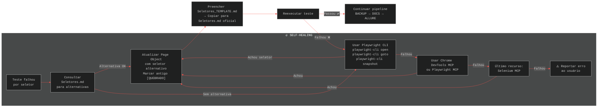

# Fluxo da IA ao Receber uma História de Usuário

```mermaid
%%{init: {'theme': 'dark', 'themeVariables': { 'primaryColor': '#1a1b2e', 'primaryTextColor': '#e6e6e6', 'primaryBorderColor': '#58a6ff', 'lineColor': '#58a6ff', 'secondaryColor': '#161b22', 'tertiaryColor': '#0d1117', 'fontFamily': 'Consolas, monospace' }}}%%
flowchart TB
    subgraph INPUT["📥 ENTRADA — História de Usuário"]
        A["Usuário envia história:<br><i>'Criar conta, comprar produtos<br>de marcas diferentes, logout,<br>login com persistência, checkout,<br>avaliação, invoice, excluir conta'</i>"]
    end

    subgraph ANALYSIS["🔍 FASE 1 — ANÁLISE E PLANEJAMENTO"]
        B["1.1. Ler governança do projeto<br><b>AGENTS.md</b>"]
        C["1.2. Ler padrões de código<br><b>Guia_Cypress_Template.md</b>"]
        D["1.3. Ler templates de documentação<br><b>*_TEMPLATE.md</b>"]
        E["1.4. Verificar Page Objects existentes<br><b>pages/*.js</b>"]
        F["1.5. Verificar seletores existentes<br><b>Seletores.md</b>"]
        G["1.6. Verificar fixtures existentes<br><b>fixtures/*.json</b>"]
        H["1.7. Verificar UserFactory<br><b>data/UserFactory.js</b>"]
        I["1.8. DECOMPOR história em TCs<br>seguindo nomenclatura do projeto"]
    end

    subgraph DECOMP["🧩 FASE 2 — DECOMPOSIÇÃO EM TEST CASES"]
        J["TC_WEB_027_sucesso_criar_conta_comprar_produtos_logout_relogin_checkout_invoice_excluir_conta.cy.js"]
        K["Teste Único E2E<br>que cobre o fluxo completo<br>(cenário de sucesso)"]
        L["Classificação: <b>@sucesso</b><br>Tags: <b>@TC_WEB_027</b><br>Criticidade: <b>Crítica</b>"]
        M["Dados: <b>UserFactory.generate()</b><br>(dados dinâmicos únicos)"]
    end

    subgraph PIPELINE["⚙️ FASE 3 — PIPELINE (CODE → RUN → DOCS → ALLURE)"]
        direction TB

        subgraph CODE["3.1 CODE"]
            C1["Criar arquivo .cy.js<br>seguindo template exato"]
            C2["Importar Page Objects<br>necessários"]
            C3["Usar UserFactory<br>para dados dinâmicos"]
            C4["Usar fixtures para<br>dados estáticos e UI texts"]
            C5["Implementar steps numerados<br>com comentários em português"]
            C6["Adicionar cy.captura()<br>em cada passo"]
        end

        subgraph RUN["3.2 RUN"]
            R1["Executar:<br><code>npx cypress run --spec<br>\"cypress/e2e/web/TC_WEB_027_*.cy.js\"</code>"]
            R2{"Resultado?"}
            R3["✅ <b>PASSOU</b>"]
            R4["❌ <b>FALHOU</b>"]
        end

        subgraph SELF_HEAL["🔄 SELF-HEALING (se falhou)"]
            SH1["Consultar <b>Seletores.md</b><br>para alternativas"]
            SH2["Usar <b>Playwright CLI</b><br>para inspecionar live site"]
            SH3["Usar <b>Chrome DevTools MCP</b><br>para debug de CSS/layout"]
            SH4["Usar <b>Playwright MCP</b><br>para inspeção alternativa"]
            SH5["Usar <b>Selenium MCP</b><br>último recurso"]
            SH6["Atualizar <b>Seletores.md</b><br>marcar antigo [QUEBRADO]<br>adicionar novo seletor"]
            SH7["Atualizar <b>Page Object</b><br>com novo seletor"]
            SH8["Reexecutar teste"]
        end

        subgraph BACKUP["3.3 BACKUP"]
            B1["Copiar TODOS os<br>documentos de E2E para<br><b>Backup/</b>"]
            B2["Formato:<br><code>copy \"[file]\" \"Backup/\\n[nome]_[YYYYMMDD_HHmmss].ext\"</code>"]
        end

        subgraph UPDATE_DOCS["3.4 UPDATE DOCS"]
            D1["LER template<br><b>Sumario_Executivo_TEMPLATE.md</b>"]
            D2["Atualizar <b>Sumario_Executivo.md</b><br>+ linha no catálogo"]
            D3["LER template<br><b>Especificacao_Tecnica_Web_TEMPLATE.md</b>"]
            D4["Atualizar <b>Especificacao_Tecnica_Web.md</b><br>+ TC completo com steps"]
            D5["LER template<br><b>Suite_BDD_TEMPLATE.md</b>"]
            D6["Atualizar <b>Suite_BDD.md</b><br>+ cenário Gherkin"]
            D7["Seguir padrões:<br>• Dado em linguagem natural<br>• Gherkin (Dado/Quando/Então)<br>• Máx 7 blocos<br>• Script link obrigatório"]
        end

        subgraph ALLURE["3.5 ALLURE"]
            A1["Cypress gera<br>allure-results<br>automaticamente"]
            A2["Confirmar que<br>allure-results contém<br>o novo TC"]
            A3["Gerar relatório:<br><code>allure.cmd generate --clean<br>-o allure-report allure-results<br>--lang br --name \"AutomationExercise\"</code>"]
        end

        subgraph VERIFY["3.6 VERIFY"]
            V1["Verificar links<br>quebrados nos docs"]
            V2["Verificar numeração<br>sem gaps"]
            V3["Confirmar evidências<br>(screenshots/GIFs/HTML)"]
        end
    end

    subgraph OUTPUT["📦 FASE 4 — ENTREGÁVEIS"]
        O1["📄 Script de teste<br><code>TC_WEB_027_sucesso_....cy.js</code></b>"]
        O2["📸 Screenshots numerados<br>em <code>screenshots/web/</code>"]
        O3["🎬 GIF animado do fluxo<br>gerado via <code>gerar_gifs.js</code>"]
        O4["📊 <b>Sumario_Executivo.md</b><br>atualizado com novo TC"]
        O5["📋 <b>Especificacao_Tecnica_Web.md</b><br>atualizada com steps"]
        O6["📖 <b>Suite_BDD.md</b><br>atualizada com Gherkin"]
        O7["📈 <b>Allure Report</b><br>com novo caso + histórico"]
        O8["🔗 Rastreabilidade total<br>entre docs, script e evidência"]
    end

    A --> B
    B --> C --> D --> E --> F --> G --> H --> I
    I --> J
    J --> K
    K --> L
    L --> M

    M --> C1
    C1 --> C2 --> C3 --> C4 --> C5 --> C6
    C6 --> R1
    R1 --> R2

    R2 -->|Falhou| R4
    R4 --> SH1
    SH1 --> SH2 --> SH3 --> SH4 --> SH5
    SH5 --> SH6 --> SH7 --> SH8
    SH8 --> R1

    R2 -->|Passou| R3
    R3 --> B1 --> B2
    B2 --> D1 --> D2 --> D3 --> D4 --> D5 --> D6 --> D7
    D7 --> A1 --> A2 --> A3
    A3 --> V1 --> V2 --> V3

    V3 --> O1
    V3 --> O2
    V3 --> O3
    V3 --> O4
    V3 --> O5
    V3 --> O6
    V3 --> O7
    V3 --> O8
```

---

## 🔬 Detalhamento por Fase

### FASE 1 — Análise e Planejamento

| Etapa | O que a IA faz | Onde consulta |
|:------|:---------------|:--------------|
| **1.1** | Lê as regras de governança, pipeline, backup e documentação | [`AGENTS.md`](../AGENTS.md) |
| **1.2** | Lê padrões de nomenclatura, Page Objects, step numbering, Zero Hardcoded | [`Guia_Cypress_Template.md`](../automationexercise/templates/Guia_Cypress_Template.md) |
| **1.3** | Lê templates de documentação para saber a estrutura exata de cada seção | [`*_TEMPLATE.md`](../automationexercise/templates/) |
| **1.4** | Verifica quais Page Objects já existem (HomePage, LoginPage, SignupPage, AccountPage, ProductsPage, CheckoutPage) | [`pages/`](../automationexercise/Cypress/cypress/pages/) |
| **1.5** | Verifica seletores já documentados para reutilizar | [`Seletores.md`](../automationexercise/templates/Seletores.md) |
| **1.6** | Verifica dados estáticos disponíveis (users, products, ui_texts) | [`fixtures/`](../automationexercise/Cypress/cypress/fixtures/) |
| **1.7** | Verifica a factory de dados dinâmicos | [`UserFactory.js`](../automationexercise/Cypress/cypress/data/UserFactory.js) |
| **1.8** | Decompõe a história em **1 único teste E2E** (fluxo completo de sucesso), classificando como `@sucesso` | Análise interna |

---

### FASE 2 — Decomposição da História em Passos do Teste

A história do usuário é traduzida em steps numerados, mantendo **fidelidade ao cenário original**:

| Step | Ação | Page Object | Screenshot |
|:----:|:----|:-----------|:----------:|
| 01 | Abrir navegador (via beforeEach) | `cy.visit('/')` | ✅ |
| 02 | Clicar em Signup / Login | `HomePage.clickSignupLogin()` | ✅ |
| 03 | Preencher nome e email (dinâmico) | `LoginPage.fillSignup()` | ✅ |
| 04 | Clicar em Signup | `LoginPage.clickSignup()` | ✅ |
| 05 | Preencher Account Information | `SignupPage.fillAccountInfo()` | ✅ |
| 06 | Clicar em Create Account | `SignupPage.clickCreateAccount()` | ✅ |
| 07 | Validar Account Created! | `AccountPage.verifyAccountCreated()` | ✅ |
| 08 | Clicar Continue | `AccountPage.clickContinue()` | ✅ |
| 09 | Validar "Logged in as [user]" | `HomePage.verifyLoggedInAs()` | ✅ |
| 10 | Navegar para Products | `HomePage.clickProducts()` | ✅ |
| 11 | Selecionar produto Marca A, Qtd 2 | `ProductsPage.addToCart()` | ✅ |
| 12 | Clicar Continue Shopping | modal | ✅ |
| 13 | Selecionar produto Marca B, Qtd 3 | `ProductsPage.addToCart()` | ✅ |
| 14 | Clicar Continue Shopping | modal | ✅ |
| 15 | Selecionar produto Marca C, Qtd 1 | `ProductsPage.addToCart()` | ✅ |
| 16 | Clicar View Cart | modal | ✅ |
| 17 | Validar quantidades e marcas no carrinho | `CheckoutPage.verifyCart()` | ✅ |
| 18 | Clicar Logout | `HomePage.clickLogout()` | ✅ |
| 19 | Login com email/senha criados | `LoginPage.login(email, password)` | ✅ |
| 20 | Validar carrinho persistiu | `HomePage.clickCart()` | ✅ |
| 21 | Validar produtos ainda no carrinho | `CheckoutPage.verifyCart()` | ✅ |
| 22 | Clicar Proceed To Checkout | `CheckoutPage.clickProceedToCheckout()` | ✅ |
| 23 | Preencher review / comment | `CheckoutPage.fillComment()` | ✅ |
| 24 | Clicar Place Order | `CheckoutPage.clickPlaceOrder()` | ✅ |
| 25 | Preencher dados de pagamento | `CheckoutPage.fillPayment()` | ✅ |
| 26 | Clicar Pay and Confirm Order | `CheckoutPage.clickPayAndConfirm()` | ✅ |
| 27 | Validar pedido confirmado | `CheckoutPage.verifyOrderPlaced()` | ✅ |
| 28 | Clicar Download Invoice | `CheckoutPage.clickDownloadInvoice()` | ✅ |
| 29 | Validar invoice baixado | `cy.readFile()` + validação | ✅ |
| 30 | Clicar Continue | `AccountPage.clickContinue()` | ✅ |
| 31 | Clicar Delete Account | `HomePage.clickDeleteAccount()` | ✅ |
| 32 | Validar Account Deleted! | `AccountPage.verifyAccountDeleted()` | ✅ |
| 33 | Clicar Continue final | `AccountPage.clickContinue()` | ✅ |

> **Regra:** Steps seguem numeração sequencial (sem sub-letters). Cada ação é um passo.

---

### FASE 3 — Pipeline Completo

#### 3.1 CODE

A IA gera o script seguindo **todas as regras** do `Guia_Cypress_Template.md`:

```
📄 TC_WEB_027_sucesso_criar_conta_comprar_produtos_logout_relogin_checkout_invoice_excluir_conta.cy.js
├── JSDoc com @tags @sucesso @TC_WEB_027
├── describe('TC_WEB_027 - ...')   ← em português
├── it('deve executar fluxo completo...')  ← verbo + resultado
├── takeScreenshot para cada passo  ← usando cy.captura()
├── Zero Hardcoded → UserFactory + fixtures + ui_texts
├── beforeEach NÃO repetido (já em support/e2e.js)
└── afterEach para captura de erro
```

**Page Objects envolvidos:**
- `HomePage` — navegação, logout, delete account
- `LoginPage` — signup e login
- `SignupPage` — formulário de cadastro
- `AccountPage` — confirmações (created/deleted)
- `ProductsPage` — busca e adição ao carrinho
- `CheckoutPage` — carrinho, checkout, pagamento, invoice

#### 3.2 RUN

```bash
npx cypress run --spec "cypress/e2e/web/TC_WEB_027_sucesso_criar_conta_comprar_produtos_logout_relogin_checkout_invoice_excluir_conta.cy.js"
```

**O que é gerado automaticamente:**
- PNGs em `screenshots/web/TC_WEB_027_...cy.js/`
- Vídeo em `videos/`
- Allure results em `allure-results/`

#### 3.3 BACKUP

Antes de TOCAR em qualquer documentação:

```bash
copy "Sumario_Executivo.md" "Backup/Sumario_Executivo_20260604_091900.md"
copy "Especificacao_Tecnica_Web.md" "Backup/Especificacao_Tecnica_Web_20260604_091900.md"
copy "Suite_BDD.md" "Backup/Suite_BDD_20260604_091900.md"
```

#### 3.4 UPDATE DOCS

**Sumario_Executivo.md** — adicionar linha na tabela:
```markdown
| TC_WEB_027 | Fluxo completo compra, logout, relogin, checkout, invoice, exclusão | ✅ | Carrinho |
```

**Especificacao_Tecnica_Web.md** — novo TC completo com:
```markdown
#### TC_WEB_027 - Fluxo completo de compra, logout, relogin, checkout, invoice e exclusão de conta
**Objetivo:** Validar o ciclo de vida completo...<br>
**Tipo:** Sucesso<br>
**Criticidade:** Crítica<br>
**Dados:** UserFactory.generate() - dados dinâmicos únicos por execução<br>
**Pós-condição:** Conta criada e excluída ao final do teste<br>
**Passos Detalhados:** tabela com 33 steps<br>
**Asserção Chave:**<br>
**Resultado esperado:** Usuário consegue criar conta, comprar múltiplos produtos, deslogar, relogar com carrinho persistido, finalizar checkout com avaliação, baixar invoice e excluir conta<br>
**Script:** TC_WEB_027_...cy.js<br>
**Evidência em GIF:**  
```

**Suite_BDD.md** — cenário Gherkin:
```gherkin
Dado Que existem dados de registro disponíveis e dados de pagamento disponíveis
Quando realizo o registro completo
E adiciono produtos de marcas diferentes com quantidades variadas ao carrinho
E valido o carrinho, realizo logout e relogo com credenciais criadas
E confirmo a persistência do carrinho
E finalizo o checkout com avaliação e pagamento
E baixo a fatura do pedido
Então a conta é excluída com sucesso ao final
```

#### 3.5 ALLURE

A IA verifica:
- Se `allure-results/` contém o resultado do novo TC
- Se o relatório Allure é gerado sem erros
- Se o histórico de execuções anteriores é preservado

```bash
allure.cmd generate --clean -o allure-report allure-results --lang br --name "AutomationExercise"
```

#### 3.6 VERIFY

Checklist de verificação:
- [ ] Links nos documentos funcionam (clique aqui → arquivo)
- [ ] Numeração não tem gaps (001-027 contínuo)
- [ ] Screenshots foram gerados para cada step
- [ ] GIF foi gerado via `gerar_gifs.js`
- [ ] Allure report contém o novo caso

---

### 🔄 Self-Healing (Se um seletor quebrar)



---

### 📊 Resumo Visual do Ciclo Completo

```
[USUÁRIO]                    [IA]                          [PROJETO]
    │                          │                               │
    ├─ História de Usuário ──► │                               │
    │                          ├─ Lê AGENTS.md ──────────────► │
    │                          ├─ Lê Guia_Cypress_Template ──► │
    │                          ├─ Lê Templates ──────────────► │
    │                          ├─ Lê Page Objects ────────────► │
    │                          ├─ Lê Seletores ───────────────► │
    │                          │                               │
    │                          ├─ DECOMPÕE história            │
    │                          │  em steps numerados           │
    │                          │                               │
    │                          ├─ [CODE] Cria .cy.js ─────────► │
    │                          ├─ [RUN] npx cypress run ──────► │
    │                          │    ├─ Screenshots ────────────► │
    │                          │    ├─ Vídeos ─────────────────► │
    │                          │    ├─ Allure results ─────────► │
    │                          │    └─ Relatório ──────────────► │
    │                          │                               │
    │                          ├─ [BACKUP] docs → Backup/ ────► │
    │                          ├─ [UPDATE DOCS] ──────────────► │
    │                          │    ├─ Sumario_Executivo        │
    │                          │    ├─ Especificacao_Tecnica    │
    │                          │    └─ Suite_BDD (Gherkin)      │
    │                          │                               │
    │                          ├─ [ALLURE] gera relatório ────► │
    │                          ├─ [VERIFY] valida links/docs ──► │
    │                          │                               │
    │◄─────────────────────────┼─ 8 entregáveis prontos        │
    │                          │   ✓ Script de teste           │
    │                          │   ✓ Screenshots + GIF         │
    │                          │   ✓ 3 documentos atualizados  │
    │                          │   ✓ Allure report             │
    │                          │   ✓ Rastreabilidade total     │
```

---

### 🏷️ Nomenclatura Gerada pela IA

| Artefato | Nome |
|:---------|:-----|
| **Script** | `TC_WEB_027_sucesso_criar_conta_comprar_produtos_logout_relogin_checkout_invoice_excluir_conta.cy.js` |
| **describe()** | `TC_WEB_027 - Fluxo completo de compra, logout, relogin, checkout, invoice e exclusão de conta` |
| **it()** | `deve executar fluxo completo de compra com persistência e exclusão de conta` |
| **JSDoc Tags** | `@sucesso @TC_WEB_027` |
| **Pasta screenshots** | `cypress/screenshots/web/TC_WEB_027_sucesso_criar_conta_comprar_produtos_logout_relogin_checkout_invoice_excluir_conta.cy.js/` |
| **GIF** | `TC_WEB_027_sucesso_criar_conta_comprar_produtos_logout_relogin_checkout_invoice_excluir_conta.gif` |

---

### ⚙️ Regras Críticas que a IA Segue

1. **CODE FIRST — DOCUMENT AFTER:** Nunca documenta um teste não executado
2. **Zero Hardcoded:** Nem email, nem senha, nem texto de UI fixo no script
3. **UserFactory para contas que criam e deletam:** Dados dinâmicos únicos
4. **Fixtures para dados estáticos:** Credenciais de login, produtos, UI texts
5. **Step numbering sequencial:** Sem sub-letters (4a, 4b)
6. **Screenshots em cada passo:** Usando `cy.captura()` com numeração `NN_`
7. **Self-healing antes de reportar erro:** Consulta Seletores.md → Playwright CLI → MCPs
8. **Backup antes de qualquer alteração em docs:** `Backup/[file]_[timestamp].ext`
9. **Template mirror:** Documentos seguem exatamente a estrutura do `*_TEMPLATE.md`
10. **Allure no final:** Confirma que allure-results foi gerado

---

**Documento gerado em:** 2026-06-04
