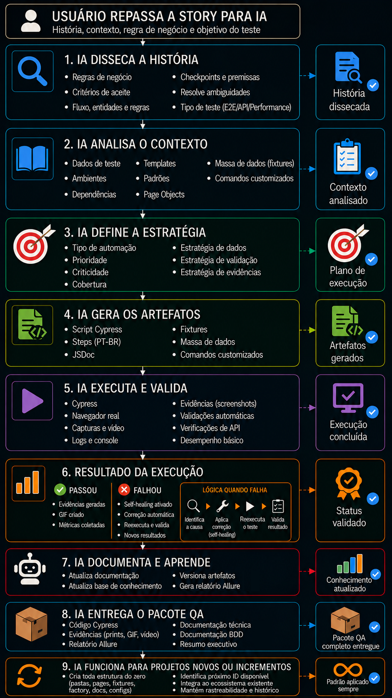

# 🧪 Framework de Automação com IA — Automation Exercise

[](https://www.cypress.io/)
[](https://k6.io/)
[](https://nodejs.org/)
[](https://allurereport.org/)
[](https://github.com/microsoft/playwright-cli)
[](https://github.com/ChromeDevTools/chrome-devtools-mcp)
[](https://github.com/microsoft/playwright-mcp)
[](https://github.com/angiejones/mcp-selenium)

Framework de automação de testes para o site [Automation Exercise](https://www.automationexercise.com) — uma loja virtual de demonstração — seguindo o padrão ouro do mercado. Combina testes funcionais (E2E e API), testes de performance, documentação ISTQB/BDD e inteligência artificial.

Cada teste, documento e relatório são gerados e mantidos por IA, desde os scripts até a documentação técnica, BDD e relatórios de performance. A IA codifica, executa, documenta, corrige seletores e mantém a rastreabilidade entre execuções no Allure. Tudo dentro de uma governança rígida e pré-definida. O ciclo completo de QA é padronizado e automatizado, garantindo consistência em cada etapa.

Arquitetura orientada a **alta manutenibilidade e repetibilidade**: os componentes são separados por responsabilidade, os dados organizados de forma centralizada e cada fluxo de teste é independente e rastreável. Um ecossistema escalável pensado para crescer sem perder a qualidade.

**61 casos individuais no Allure** · 26 E2E · 14 API · 21 performance (13 k6 + 8 Core Web Vitals)

---

---

## 📋 Sumário

- [🛠 Stack](#stack)
- [🏗 Estrutura do Projeto](#estrutura-do-projeto)
- [📊 Testes E2E Web](#testes-e2e-web-26)
- [📊 Testes de API](#testes-de-api-14)
- [📊 Testes de Performance](#testes-de-performance-14)
- [📸 Evidências](#evidencias)
- [📄 Documentação](#documentacao)
- [🤖 Uso com Agentes de IA](#uso-com-agentes-de-ia)
- [🧠 Documentação IA](#documentacao-ia)
- [📈 Rastreabilidade Histórica](#rastreabilidade-historica)
- [🚀 Como Executar](#como-executar)

---

<a name="stack"></a>
## 🛠 Stack

| Ferramenta | Versão | Finalidade |
|:-----------|:------:|:-----------|
| [Cypress](https://www.cypress.io/) | 15.15.0 | Testes E2E, API e Core Web Vitals |
| [k6](https://k6.io/) | v2.0.0 | Testes de performance e carga |
| [Playwright CLI](https://github.com/microsoft/playwright-cli) | 1.0+ | Self-healing e inspeção de seletores  |
| [Chrome DevTools MCP](https://github.com/ChromeDevTools/chrome-devtools-mcp) | latest | Debugging ativo — console, network, performance, Lighthouse |
| [Playwright MCP](https://github.com/microsoft/playwright-mcp) | latest | Automação de navegação, formulários e fluxos E2E |
| [Selenium MCP](https://github.com/angiejones/mcp-selenium) | latest | Fluxos legados e compatibilidade WebDriver |
| [Allure](https://allurereport.org/) | 2.42.0 | Relatório interativo dos testes (pt-BR + dark mode) |
| [gifencoder](https://www.npmjs.com/package/gifencoder) | 2.x | Geração de GIFs animados |
| [canvas](https://www.npmjs.com/package/canvas) | 2.x | Processamento de imagens |
| [Node.js](https://nodejs.org/) | 20.19.5 | Runtime |

---

<a name="estrutura-do-projeto"></a>
## 🏗 Estrutura do Projeto

```
Projeto/
│
├── AGENTS.md                                      # Governança para agentes de IA
├── README.md                                      # Este arquivo
│
├── automationexercise/
│   ├── install_all.sh                             # Instala todas as dependências (Linux/macOS/WSL)
│   ├── install_all.bat                            # Instala todas as dependências (Windows)
│   │
│   ├── Cypress/                                   # Motor de automação
│   │   ├── cypress.config.js                      # Config: trash, video, reporter, after:spec
│   │   ├── run_all.bat                            # Script único: Cypress + k6 + GIFs + relatório (Windows)
│   │   ├── run_all.sh                             # Script único: Cypress + k6 + GIFs + relatório (Linux/macOS/WSL)
│   │   ├── package.json                           # Dependências Node (Cypress, Allure, etc.)
│   │   ├── scripts/                               # Utilitários
│   │   │   └── gerar_gifs.js                      # Gera GIFs animados
│   │   │
│   │   ├── cypress/
│   │   │   ├── e2e/
│   │   │   │   ├── web/                           # 26 testes E2E Web (TC_WEB_001-TC_WEB_026)
│   │   │   │   ├── api/                           # 14 testes de API (TC_API_001-TC_API_014)
│   │   │   │   └── performance/                   # 13 k6 + 1 Cypress Core Web Vitals
│   │   │   │
│   │   │   ├── pages/                             # 9 Page Objects (POM)
│   │   │   │   ├── index.js                       # Exportação centralizada dos pages
│   │   │   │   ├── HomePage.js                    # Página inicial, cabeçalho, rodapé
│   │   │   │   ├── LoginPage.js                   # Página de login e signup
│   │   │   │   ├── SignupPage.js                  # Página de cadastro completo
│   │   │   │   ├── AccountPage.js                 # Página de confirmação (criação/exclusão)
│   │   │   │   ├── ContactUsPage.js               # Página de formulário de contato
│   │   │   │   ├── TestCasesPage.js               # Página de casos de teste
│   │   │   │   ├── ProductsPage.js                # Página de produtos (listagem, busca, detalhe)
│   │   │   │   └── CheckoutPage.js                # Página de checkout e pagamento
│   │   │   │
│   │   │   ├── data/                              # Factories
│   │   │   │   └── UserFactory.js                 # Dados dinâmicos únicos por execução
│   │   │   │
│   │   │   ├── fixtures/                          # Dados estáticos
│   │   │   │   ├── users.json                     # Credenciais e dados de pagamento
│   │   │   │   ├── products.json                  # Produtos, categorias, marcas
│   │   │   │   ├── contact.json                   # Mensagens e assuntos
│   │   │   │   ├── ui_texts.json                  # Labels, headers, erros, botões
│   │   │   │   └── test_file.txt                  # Arquivo de teste para upload
│   │   │   │
│   │   │   ├── support/                           # Comandos customizados
│   │   │   │   └── e2e.js                         # beforeEach centralizado + cy.captura()
│   │   │   │
│   │   │   ├── downloads/                         # Downloads temporários (faturas)
│   │   │   ├── screenshots/                       # Evidências visuais (resetado a cada run)
│   │   │   │   ├── web/                           # PNGs + GIFs por spec
│   │   │   │   ├── api/                           # HTML reports das APIs
│   │   │   │   └── performance/                   # PNGs + GIF do TC_PF_008
│   │   │   │
│   │   │   ├── reports/                           # Relatórios de execução
│   │   │   │   └── k6/                            # JSONs do k6 --summary-export
│   │   │   │
│   │   │   ├── allure/                            # Relatórios Allure
│   │   │   │   ├── allure.properties              # Tema escuro + idioma pt-BR
│   │   │   │   ├── allure-results/                # Resultados das execuções (gerado pelo Cypress)
│   │   │   │   ├── allure-report/                 # Relatório HTML estático (gerado via allure.cmd)
│   │   │   │   └── scripts/                       # Conversores k6 → Allure
│   │   │   │
│   │   │   └── videos/                            # Vídeos das execuções (auto)
│   │   │
│   │   └── .gitignore
│   │
│   ├── docs/                                      # Documentação viva do projeto
│   │   ├── Sumario_Executivo.md                   # Visão geral, escopo, KPIs, riscos
│   │   ├── Especificacao_Tecnica_Web.md           # Plano detalhado dos 26 testes E2E
│   │   ├── Especificacao_Tecnica_API.md           # Plano detalhado dos 14 testes de API
│   │   ├── Especificacao_Tecnica_Performance.md   # Plano detalhado dos 14 testes de performance
│   │   ├── Suite_BDD.md                           # Cenários em Gherkin para stakeholders
│   │   ├── Relatorio_Resultados_Performance.md    # Métricas e resultados consolidados (k6 + Lighthouse)
│   │   └── Relatorio_Testes.lnk                   # Atalho → sobe Allure serve + abre em http://localhost:8765
│   │
│   └── templates/                                 # Modelos e documentação para IA
│       ├── Sumario_Executivo_TEMPLATE.md          # Template do Sumário Executivo
│       ├── Especificacao_Tecnica_Web_TEMPLATE.md  # Template de especificação técnica (E2E Web)
│       ├── Especificacao_Tecnica_API_TEMPLATE.md  # Template de especificação técnica (API)
│       ├── Especificacao_Tecnica_Performance_TEMPLATE.md # Template de especificação técnica (Performance)
│       ├── Suite_BDD_TEMPLATE.md                  # Template de cenários BDD (Gherkin)
│       ├── Story_TEMPLATE.md                     # Template de dissecção de histórias de usuário
│       ├── Relatorio_Resultados_Performance_TEMPLATE.md # Template de relatório de resultados
│       ├── Guia_Cypress_TEMPLATE.md               # Template de codificação e padrões do projeto
│       ├── Seletores_TEMPLATE.md                  # Template de estrutura para novos seletores (IA)
│       └── Seletores.md                           # Histórico de seletores e self-healing (IA)
│   │
│   └── Backup/                                    # Backups automáticos de documentação
│
```

---

<a name="testes-e2e-web-26"></a>
## 📊 Testes E2E Web (26)

| ID | Teste | Tipo | Grupo |
|:---|:------|:----:|:------|
| TC_WEB_001 | Registrar novo usuário | ✅ | Identidade |
| TC_WEB_002 | Login com credenciais corretas | ✅ | Identidade |
| TC_WEB_003 | Login com credenciais incorretas | ❌ | Identidade |
| TC_WEB_004 | Logout | ✅ | Identidade |
| TC_WEB_005 | Registrar com email existente | ❌ | Identidade |
| TC_WEB_006 | Formulário de contato | ✅ | Comunicação e Experiência do Usuário |
| TC_WEB_007 | Verificar página de casos de teste | ✅ | Comunicação e Experiência do Usuário |
| TC_WEB_008 | Verificar todos os produtos + detalhes | ✅ | Catálogo |
| TC_WEB_009 | Pesquisar produto | ✅ | Catálogo |
| TC_WEB_010 | Assinatura na página inicial | ✅ | Comunicação e Experiência do Usuário |
| TC_WEB_011 | Assinatura na página do carrinho | ✅ | Comunicação e Experiência do Usuário |
| TC_WEB_012 | Adicionar produtos ao carrinho | ✅ | Carrinho |
| TC_WEB_013 | Verificar quantidade no carrinho | ✅ | Carrinho |
| TC_WEB_014 | Fazer pedido (registrar no checkout) | ✅ | Checkout |
| TC_WEB_015 | Fazer pedido (registrar antes) | ✅ | Checkout |
| TC_WEB_016 | Fazer pedido (login antes) | ✅ | Checkout |
| TC_WEB_017 | Remover produtos do carrinho | ✅ | Carrinho |
| TC_WEB_018 | Visualizar por categoria | ✅ | Catálogo |
| TC_WEB_019 | Visualizar por marca | ✅ | Catálogo |
| TC_WEB_020 | Pesquisar + verificar carrinho + login | ✅ | Carrinho |
| TC_WEB_021 | Adicionar avaliação | ✅ | Catálogo |
| TC_WEB_022 | Itens recomendados | ✅ | Carrinho |
| TC_WEB_023 | Detalhes de endereço no checkout | ✅ | Checkout |
| TC_WEB_024 | Baixar fatura | ✅ | Checkout |
| TC_WEB_025 | Scroll com seta | ✅ | Comunicação e Experiência do Usuário |
| TC_WEB_026 | Scroll sem seta | ✅ | Comunicação e Experiência do Usuário |

**24 Sucesso · 2 Erro**

---

<a name="testes-de-api-14"></a>
## 📊 Testes de API (14)

| ID | Teste | Tipo |
|:---|:------|:----:|
| TC_API_001 | Listar todos os produtos | ✅ |
| TC_API_002 | Listar todas as marcas | ✅ |
| TC_API_003 | Pesquisar produto | ✅ |
| TC_API_004 | Pesquisar sem parâmetro | ❌ |
| TC_API_005 | Verificar login válido | ✅ |
| TC_API_006 | Verificar login sem email | ❌ |
| TC_API_007 | Verificar login inválido | ❌ |
| TC_API_008 | Criar conta | ✅ |
| TC_API_009 | Excluir conta | ✅ |
| TC_API_010 | Atualizar conta | ✅ |
| TC_API_011 | Obter detalhes do usuário | ✅ |
| TC_API_012 | Método POST em productsList | ❌ |
| TC_API_013 | Método PUT em brandsList | ❌ |
| TC_API_014 | Método DELETE em verifyLogin | ❌ |

**8 Sucesso · 6 Erro**

---

<a name="testes-de-performance-14"></a>
## 📊 Testes de Performance (14)

| ID | Cenário | Tipo | Status |
|:---|:--------|:----:|:------:|
| TC_PF_001 | Smoke test | Validação | ✅ |
| TC_PF_002 | Carga Homepage | Carga | ✅ |
| TC_PF_003 | Carga API Produtos | Carga | ✅ |
| TC_PF_004 | Carga API Login | Carga | ✅ |
| TC_PF_005 | Estresse API Produtos | Estresse | ⚠️ |
| TC_PF_006 | Resistência (Soak) | Resistência | ✅ |
| TC_PF_007 | Pico (Spike) | Pico | ⚠️ |
| TC_PF_008 | Core Web Vitals | Lighthouse | ✅ |
| TC_PF_009 | Fluxo Checkout | Carga | ✅ |
| TC_PF_010 | Auditoria de Imagens | Auditoria | ✅ |
| TC_PF_011 | Carga Update Account | Carga | ✅ |
| TC_PF_012 | Carga User Details | Carga | ✅ |
| TC_PF_013 | Carga Search Product | Carga | ✅ |
| TC_PF_014 | Carga Página Produtos | Carga | ✅ |

**12 ✅ · 2 ⚠️** (rate limiting Cloudflare)

---

<a name="evidencias"></a>
## 📸 Evidências

Cada execução gera screenshots PNG de cada passo, vídeos e relatórios HTML. O GIF abaixo ilustra o fluxo completo do checkout — 26 steps, ~50s de execução:

### TC_WEB_015 — Pedido registrando antes do checkout


> GIF gerado automaticamente via `scripts/gerar_gifs.js` a partir dos PNGs de cada passo.

Cada TC na [Especificação Técnica Web](automationexercise/docs/Especificacao_Tecnica_Web.md) possui seu próprio GIF inline.

---

<a name="documentacao"></a>
## 📄 Documentação

| Documento | Conteúdo |
|:----------|:---------|
| [`Sumario_Executivo.md`](automationexercise/docs/Sumario_Executivo.md) | Visão geral, escopo, KPIs, riscos, ambiente |
| [`Especificacao_Tecnica_Web.md`](automationexercise/docs/Especificacao_Tecnica_Web.md) | Plano detalhado dos 26 testes E2E com GIFs |
| [`Especificacao_Tecnica_API.md`](automationexercise/docs/Especificacao_Tecnica_API.md) | Plano detalhado dos 14 testes de API |
| [`Especificacao_Tecnica_Performance.md`](automationexercise/docs/Especificacao_Tecnica_Performance.md) | Plano detalhado dos 14 testes de performance |
| [`Suite_BDD.md`](automationexercise/docs/Suite_BDD.md) | Cenários em Gherkin para stakeholders |
| [`Relatorio_Resultados_Performance.md`](automationexercise/docs/Relatorio_Resultados_Performance.md) | Métricas e resultados consolidados (k6 + Lighthouse) |
| [`Relatorio_Testes.lnk`](automationexercise/docs/Relatorio_Testes.lnk) | Atalho → abre servidor Allure com relatório completo |

---

<a name="uso-com-agentes-de-ia"></a>
## 🤖 Uso com Agentes de IA

O [`AGENTS.md`](AGENTS.md) é o núcleo de governança do framework. Ele define como a IA deve atuar em cada etapa do ciclo de QA, desde a geração de scripts até o self-healing de seletores. O agente não se limita a documentar — ele **orquestra o ciclo completo do framework** em 9 etapas:

1. **🔬 Dissecar** — Disseca a história de usuário aplicando o `Story_TEMPLATE.md`: extrai estrutura, classifica tipo (E2E/API/Performance), mapeia fluxo, entidades, regras de negócio e checkpoints. Identifica premissas ocultas, resolve ambiguidades e produz um **handoff estruturado** (Seção 8 do template) que alimenta a etapa seguinte sem ruído.
2. **📚 Contextualizar** — Contextualiza o projeto usando o handoff para guiar a leitura seletiva e incrementa com as regras de governança: `AGENTS.md`, padrões `Guia_Cypress_TEMPLATE.md`, templates de documentação, Page Objects, base de seletores `Seletores.md` e dados disponíveis `fixtures/` + `UserFactory`
3. **🧠 Planejar** — Planeja o teste gerando ID sequencial do TC (ex: TC_WEB_027), classifica como sucesso ou erro, decompõe a história em steps numerados, mapeia quais Page Objects usar e decide entre dados dinâmicos (factory) ou estáticos (fixture)
4. **✍️ Criar** — Cria o arquivo .cy.js com JSDoc contendo @tags, importa os Page Objects necessários, implementa cada passo com comentário numerado em português, adiciona cy.captura() em cada interação e mantém a abstração entre camadas (pages, fixtures, factory)
5. **▶️ Executar** — Executa o teste com `npx cypress run --spec` no navegador configurado, rodando cada passo automaticamente como um usuário real, enquanto gera screenshots por passo, grava vídeo da execução e exporta resultados para o Allure
6. **🔀 Decidir** — Decide entre seguir ou corrigir: se passa, screenshots são salvos, GIF animado gerado via `gerar_gifs.js` e HTML reports consolidados como evidência. Se falha, dispara a cadeia de auto-correção em 5 níveis — 1º consulta `Seletores.md` por alternativas, 2º Playwright CLI, 3º Chrome DevTools MCP, 4º Playwright MCP, 5º Selenium MCP. Após encontrar o seletor, atualiza o `Seletores.md` marcando o antigo como `[QUEBRADO]` e incluindo data de restauração se voltar a funcionar `[RESTAURADO]`, corrige o Page Object e reexecuta
7. **📄 Documentação completa** — Documenta gerando Sumário Executivo, Suite BDD, Especificações Técnicas (Web, API, Performance) e relatório de resultados utilizando o Allure Report
8. **📦 Entregar** — Entrega 4 artefatos: script .cy.js validado, pasta com prints numerados + GIF animado, 3 documentos técnicos consistentes e relatório Allure com histórico
9. **🔄 Funciona para projetos novos ou incrementos** — Se o projeto não tem nada, a IA cria toda a estrutura do zero (pastas, pages, fixtures, factory, docs, configurações). Se já existe, identifica o próximo ID disponível, integra ao ecossistema existente e mantém a rastreabilidade com o histórico sem quebrar nada. O padrão é sempre o mesmo, independente do ponto de partida

Isso transforma o projeto em um **framework dirigido por IA**: todo artefato — script, documento, GIF, relatório — segue o mesmo padrão, independentemente do modelo de IA usado, garantindo consistência e rastreabilidade em toda a suíte.



---

<a name="documentacao-ia"></a>
## 🧠 Documentação IA

Documentos de suporte utilizados exclusivamente pelo agente de IA para geração e manutenção de testes:

| Documento | Conteúdo |
|:----------|:---------|
| [`Guia_Cypress_TEMPLATE.md`](automationexercise/templates/Guia_Cypress_TEMPLATE.md) | Padrões de codificação, nomenclatura e boas práticas |
| [`Seletores_TEMPLATE.md`](automationexercise/templates/Seletores_TEMPLATE.md) | Template de estrutura para novos seletores |
| [`Seletores.md`](automationexercise/templates/Seletores.md) | Histórico de seletores e self-healing |
| [`Sumario_Executivo_TEMPLATE.md`](automationexercise/templates/Sumario_Executivo_TEMPLATE.md) | Template do Sumário Executivo |
| [`Especificacao_Tecnica_Web_TEMPLATE.md`](automationexercise/templates/Especificacao_Tecnica_Web_TEMPLATE.md) | Template de especificação técnica (E2E Web) |
| [`Especificacao_Tecnica_API_TEMPLATE.md`](automationexercise/templates/Especificacao_Tecnica_API_TEMPLATE.md) | Template de especificação técnica (API) |
| [`Especificacao_Tecnica_Performance_TEMPLATE.md`](automationexercise/templates/Especificacao_Tecnica_Performance_TEMPLATE.md) | Template de especificação técnica (Performance) |
| [`Suite_BDD_TEMPLATE.md`](automationexercise/templates/Suite_BDD_TEMPLATE.md) | Template de cenários BDD (Gherkin) |
| [`Story_TEMPLATE.md`](automationexercise/templates/Story_TEMPLATE.md) | Template de dissecção de histórias de usuário |
| [`Relatorio_Resultados_Performance_TEMPLATE.md`](automationexercise/templates/Relatorio_Resultados_Performance_TEMPLATE.md) | Template de relatório de resultados |

---

<a name="rastreabilidade-historica"></a>
## 📈 Rastreabilidade Histórica

### Relatório Unificado: Allure (Cypress + k6)

O [Allure](https://allurereport.org/) gera um **relatório único** com todos os testes — Cypress E2E, API e performance k6:

- **Visão geral** — Status geral, contagem de testes, tempo de execução
- **Suítes** — Navegação por grupo (Performance com steps de checks, testes de API)
- **Comportamentos** — Organização por funcionalidade (Performance - Carga, Smoke, API - Catálogo, etc.)
- **Gráficos** — Status, duração, severidade, tendências históricas
- **Linha do tempo** — Timeline completa de execução
- **Histórico** — Acumula execuções ao longo de dias/meses (append-only via `history/`)

O **histórico** funciona assim:
1. Ao gerar o relatório, o Allure salva `history/` dentro do `allure-report/`
2. O `run_all.bat` copia o `history/` do relatório anterior para `allure-results/history/` antes de gerar o novo relatório
3. O `before:run` do `cypress.config.js` preserva esse histórico durante a execução dos testes
4. Isso acumula dados de múltiplas execuções — dias, semanas, meses
5. Os gráficos de tendência mostram a evolução ao longo do tempo

📊 **Relatório publicado:** [`https://mtnirvana.github.io/AutomationExercise/allure-report/`](https://mtnirvana.github.io/AutomationExercise/allure-report/)

---

<a name="como-executar"></a>
## 🚀 Como Executar

### Obter o Projeto

```bash
# Clone padrão (branch main)
git clone https://github.com/mtnirvana/AutomationExercise.git
cd AutomationExercise

# Ou baixe o ZIP da branch main no GitHub
# https://github.com/mtnirvana/AutomationExercise/archive/refs/heads/main.zip
# → Extraia → Abra a pasta extraída
```

> A pasta raiz será `AutomationExercise/`. Todos os comandos abaixo assumem que você está dentro dela.

### Instalação Rápida (tudo de uma vez)

```bash
cd automationexercise/Cypress

# Windows (PowerShell / CMD)
.\install_all.bat

# Linux / macOS / Git Bash / WSL
bash install_all.sh
```

> Scripts equivalentes: `install_all.bat` (Windows) e `install_all.sh` (Linux/macOS/WSL).  
> **Ambos instalam exatamente o mesmo que a "Instalação Manual" abaixo** (npm, Playwright CLI, Allure local, verificação de k6).

### Instalação Manual (passo a passo)

```bash
cd automationexercise/Cypress
npm install

# Playwright CLI (self-healing de seletores)
npx playwright-cli --help
npx playwright-cli install-browser

# Allure: https://allurereport.org/docs/install/
# k6: https://grafana.com/docs/k6/latest/set-up/install/
```

### MCP Servers

Adicione ao `mcpServers` do seu cliente MCP:

```json
{
  "mcpServers": {
    "chrome-devtools": {
      "command": "npx",
      "args": ["-y", "chrome-devtools-mcp@latest"]
    },
    "playwright": {
      "command": "npx",
      "args": ["@playwright/mcp@latest"]
    },
    "selenium": {
      "command": "npx",
      "args": ["-y", "@angiejones/mcp-selenium@latest"]
    }
  }
}
```

> **Chrome DevTools MCP** — Debugging ativo: console, network, performance, Lighthouse. [Repositório](https://github.com/ChromeDevTools/chrome-devtools-mcp)<br>
> **Playwright MCP** — Automação de navegação, formulários, fluxos E2E. [Repositório](https://github.com/microsoft/playwright-mcp)<br>
> **Selenium MCP** — Fluxos legados e compatibilidade WebDriver. [Repositório](https://github.com/angiejones/mcp-selenium)

### Suíte Completa (todos os testes + relatórios)

```bash
cd automationexercise/Cypress

# Windows
run_all.bat

# Linux / macOS / WSL
bash run_all.sh
```

> Ambos geram: Cypress (E2E+API+Core Web Vitals) → GIFs → k6 (13 scripts) → Allure Report.

O `run_all.bat` / `run_all.sh` executa em sequência:

| Etapa | O que faz | Saída |
|:------|:----------|:------|
| 1. Cypress | `npx cypress run` — 41 specs | Screenshots, vídeos, allure-results |
| 2. GIFs | `node scripts/gerar_gifs.js` | GIFs em `screenshots/web/` e `screenshots/performance/` |
| 3. k6 | 13 scripts de performance | JSONs em `reports/k6/` |
| 4. k6 → Allure | `node cypress/allure/scripts/convert_k6_to_allure.js` | Resultados k6 em allure-results |
| 5. Allure | `allure.cmd generate` | Relatório em `allure-report/` |

### Execuções Individuais

```bash
cd automationexercise/Cypress

# Todos os testes (Cypress)
npx cypress run

# Apenas E2E Web
npx cypress run --spec "cypress/e2e/web/TC_WEB_*.cy.js"

# Apenas API
npx cypress run --spec "cypress/e2e/api/TC_API_*.cy.js"

# Teste específico
npx cypress run --spec "cypress/e2e/web/TC_WEB_001_*.cy.js"

# Relatório Allure (serve local)
cd cypress/allure
npx allure serve allure-results --lang br --name "AutomationExercise"
# Abre em http://localhost:8765

# Teste de performance (k6)
cd ../..
k6 run cypress/e2e/performance/TC_PF_001_smoke_test.js

# Modo interativo Cypress
npx cypress open
```

> **Windows:** Use `run_all.bat` / `install_all.bat` para fluxo completo.  
> **Linux/macOS/WSL:** Use `bash run_all.sh` / `bash install_all.sh` ou rode os comandos acima individualmente.

---

**Documento gerado em:** 2026-06-04
