# Suite de Testes BDD - Automation Exercise
**Versão:** 1.0.0<br>
**Metodologia:** BDD (Behavior Driven Development) - Gherkin<br>
**Responsável:** Rafael Barelli

---

## 1. Meta e Escopo

| Item | Descrição |
|------|-----------|
| **Projeto** | Automation Exercise - Plataforma E-commerce |
| **Total de Cenários** | 61 (26 E2E + 14 API + 13 Performance k6 + 8 Core Web Vitals) |
| **E2E** | 26 cenários |
| **API** | 14 cenários |
| **Performance** | 14 cenários (21 checks no Allure) |

> **Nota:** Performance tests (k6) e Core Web Vitals são cenários técnicos (carga, estresse, pico, auditoria) não representáveis em Gherkin. Estão contabilizados aqui para totalização, mas detalhados apenas nos documentos de performance. No contexto BDD, 40 cenários (26 E2E + 14 API) são os descritíveis em Gherkin.

---

## 2. Estrutura de Funcionalidades

### 2.1 E2E - Funcionalidades

| ID | Funcionalidade | Descrição |
|----|---------------|-----------|
| F01 | Gestão de Identidade e Acesso | Registro, Login e Logout de usuários |
| F02 | Catálogo de Produtos | Navegação, busca, detalhes e avaliação de produtos |
| F03 | Gestão de Carrinho | Adição, remoção e manipulação de itens |
| F04 | Fluxo de Checkout e Pedidos | Processo completo de compra e geração de fatura |
| F05 | Comunicação e Experiência do Usuário | Formulário de contato, newsletter, navegação de página e scroll |

### 2.2 API - Funcionalidades

| ID | Funcionalidade | Descrição |
|----|---------------|-----------|
| F06 | API Catálogo de Produtos e Marcas | Listagem e pesquisa de produtos via endpoints |
| F07 | API Autenticação | Verificação de credenciais via endpoints |
| F08 | API Gestão de Usuários | CRUD completo de usuários via endpoints |
| F09 | API Validação de Métodos HTTP | Verificação de métodos não suportados |

---

## 3. Cenários E2E

### F01 - Gestão de Identidade e Acesso

---

**F01.01** - Registrar usuário
- **Tipo:** Sucesso
- **Criticidade:** Crítica
- **Objetivo:** Validar o ciclo completo de criação e exclusão de conta com dados únicos a cada teste
- **TC:** TC_WEB_001
- **Dado:** Que existem dados de registro disponíveis
- **Pós-condição:** Conta criada e excluída ao final do teste
- **Resultado esperado:** Usuário consegue se registrar, acessar o sistema e excluir sua conta
- **Script:** [TC_WEB_001_sucesso_registrar_usuario.cy.js](../Cypress/cypress/e2e/web/TC_WEB_001_sucesso_registrar_usuario.cy.js)
- **Evidência:** 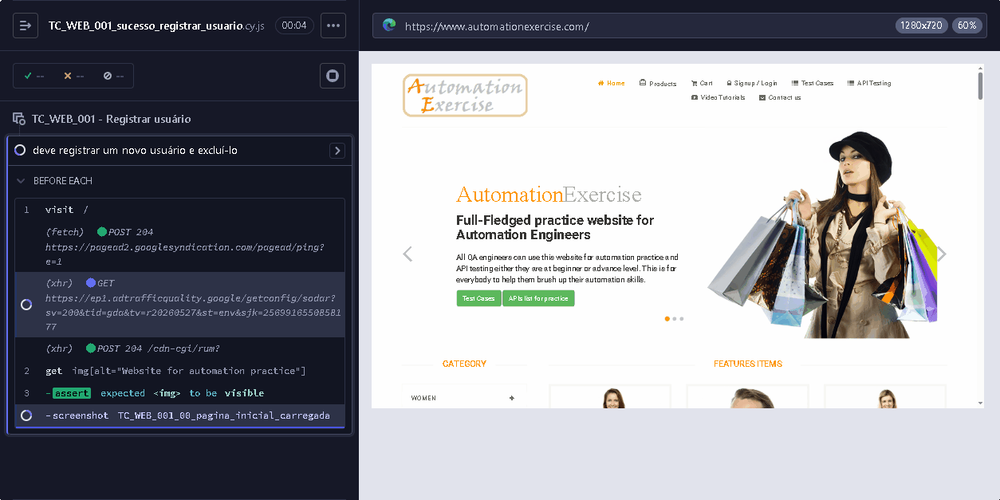

**Cenário:**
```gherkin
Dado que o navegador está aberto e a página inicial carrega
Quando clico em "Signup / Login", preencho nome e email e clico em "Signup"
Então o header "Enter Account Information" deve estar visível
Quando preencho dados do formulário de registro e clico em "Create Account"
Então o header "Account Created!" deve estar visível
Quando clico em "Continue" e confirmo "Logged in as [username]"
Então o header "Account Deleted!" deve estar visível após exclusão
```

---

**F01.02** - Login de usuário com email e senha corretos
- **Tipo:** Sucesso
- **Criticidade:** Crítica
- **Objetivo:** Garantir o acesso à área restrita para usuários cadastrados
- **TC:** TC_WEB_002
- **Dado:** Que existem credenciais pré-cadastradas no sistema
- **Pós-condição:** Nenhuma
- **Resultado esperado:** Usuário cadastrado consegue acessar sua conta
- **Script:** [TC_WEB_002_sucesso_login_usuario_email_senha_corretos.cy.js](../Cypress/cypress/e2e/web/TC_WEB_002_sucesso_login_usuario_email_senha_corretos.cy.js)
- **Evidência:** 

**Cenário:**
```gherkin
Dado que o navegador está aberto e a página inicial carrega
Quando clico em "Signup / Login", preencho email e senha e clico em "Login"
Então o texto "Logged in as [username]" deve estar visível no topo
Quando clico em "Logout"
Então o sistema redireciona para a página de login e o header "Login to your account" deve estar visível
```

---

**F01.03** - Login de usuário com email e senha incorretos
- **Tipo:** Erro
- **Criticidade:** Alta
- **Objetivo:** Validar o tratamento de erro em tentativas de acesso inválidas
- **TC:** TC_WEB_003
- **Dado:** Que existem credenciais inexistentes no sistema
- **Pós-condição:** Nenhuma
- **Resultado esperado:** Sistema impede acesso com credenciais inválidas
- **Script:** [TC_WEB_003_erro_login_usuario_email_senha_incorretos.cy.js](../Cypress/cypress/e2e/web/TC_WEB_003_erro_login_usuario_email_senha_incorretos.cy.js)
- **Evidência:** 

**Cenário:**
```gherkin
Dado que o navegador está aberto e a página inicial carrega
Quando clico em "Signup / Login"
E preencho email e senha incorretos
E clico em "Login"
Então o sistema exibe a mensagem de erro e o usuário permanece na página de login
```

---

**F01.04** - Logout de usuário
- **Tipo:** Sucesso
- **Criticidade:** Alta
- **Objetivo:** Validar o encerramento seguro da sessão
- **TC:** TC_WEB_004
- **Dado:** Que existem credenciais pré-cadastradas no sistema
- **Pós-condição:** Sessão encerrada
- **Resultado esperado:** Usuário consegue encerrar a sessão com segurança
- **Script:** [TC_WEB_004_sucesso_logout_usuario.cy.js](../Cypress/cypress/e2e/web/TC_WEB_004_sucesso_logout_usuario.cy.js)
- **Evidência:** 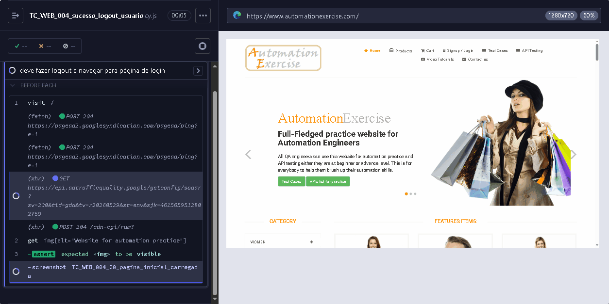

**Cenário:**
```gherkin
Dado que o navegador está aberto e a página inicial carrega
Quando clico em "Signup / Login", preencho email e senha e clico em "Login"
Então o texto "Logged in as [username]" deve estar visível no topo
Quando clico em "Logout"
Então o sistema redireciona para a página de login e o header "Login to your account" deve estar visível
```

---

**F01.05** - Registrar usuário com email existente
- **Tipo:** Erro
- **Criticidade:** Alta
- **Objetivo:** Prevenir a duplicidade de contas no sistema
- **TC:** TC_WEB_005
- **Dado:** Que existe um email já cadastrado no sistema
- **Pós-condição:** Nenhuma
- **Resultado esperado:** Sistema impede duplicidade de cadastro
- **Script:** [TC_WEB_005_erro_registrar_usuario_email_existente.cy.js](../Cypress/cypress/e2e/web/TC_WEB_005_erro_registrar_usuario_email_existente.cy.js)
- **Evidência:** 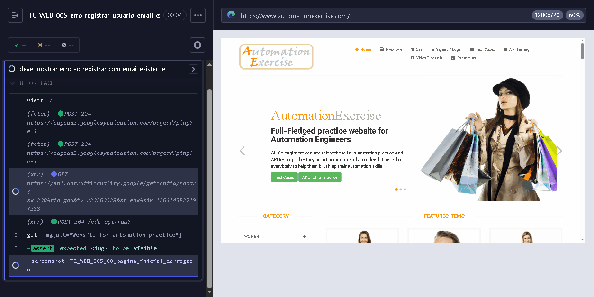

**Cenário:**
```gherkin
Dado que o navegador está aberto e a página inicial carrega
Quando clico em "Signup / Login"
E preencho nome e email já existente
E clico em "Signup"
Então o sistema exibe a mensagem de erro "Email Address already exist!"
```

---

### F02 - Catálogo de Produtos

---

**F02.01** - Verificar todos os produtos e página de detalhes do produto
- **Tipo:** Sucesso
- **Criticidade:** Alta
- **Objetivo:** Validar a integridade das informações exibidas na ficha técnica do produto
- **TC:** TC_WEB_008
- **Dado:** Que existem produtos disponíveis no catálogo
- **Pós-condição:** Nenhuma
- **Resultado esperado:** Catálogo de produtos exibe informações completas
- **Script:** [TC_WEB_008_sucesso_verificar_todos_produtos_detalhes_produto.cy.js](../Cypress/cypress/e2e/web/TC_WEB_008_sucesso_verificar_todos_produtos_detalhes_produto.cy.js)
- **Evidência:** 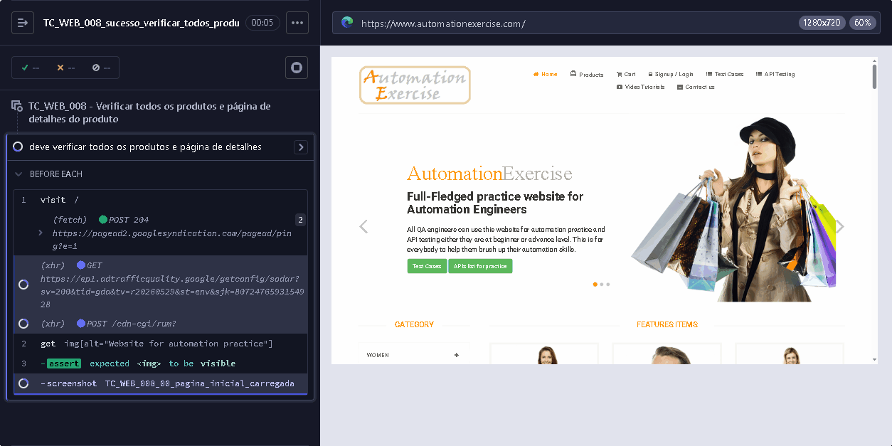

**Cenário:**
```gherkin
Dado que o navegador está aberto e a página inicial carrega
Quando clico em "Products"
Então o header "ALL PRODUCTS" e a lista de produtos devem estar visíveis
Quando clico em "View Product" do primeiro produto
Então as informações do produto devem estar visíveis (nome, categoria, preço, disponibilidade, condição, marca)
```

---

**F02.02** - Pesquisar produto
- **Tipo:** Sucesso
- **Criticidade:** Alta
- **Objetivo:** Validar o motor de busca do sistema
- **TC:** TC_WEB_009
- **Dado:** Que existe um termo de busca válido disponível
- **Pós-condição:** Nenhuma
- **Resultado esperado:** Busca retorna produtos relacionados ao termo
- **Script:** [TC_WEB_009_sucesso_pesquisar_produto.cy.js](../Cypress/cypress/e2e/web/TC_WEB_009_sucesso_pesquisar_produto.cy.js)
- **Evidência:** 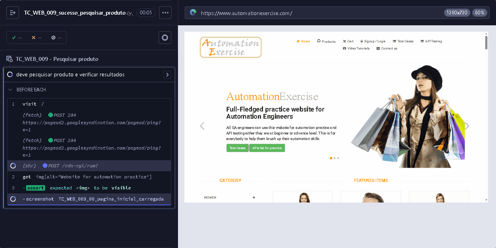

**Cenário:**
```gherkin
Dado que o navegador está aberto e a página inicial carrega
Quando clico em "Products"
E insiro o termo de busca "winter"
E clico no botão de pesquisa
Então o header "SEARCHED PRODUCTS" deve estar visível e os produtos relacionados ao termo pesquisado devem estar listados
```

---

**F02.03** - Visualizar produtos por categoria
- **Tipo:** Sucesso
- **Criticidade:** Média
- **Objetivo:** Validar que categorias e subcategorias são exibidas corretamente
- **TC:** TC_WEB_018
- **Dado:** Que existem categorias de produto válidas disponíveis
- **Pós-condição:** Nenhuma
- **Resultado esperado:** Categorias e subcategorias exibem produtos corretamente
- **Script:** [TC_WEB_018_sucesso_visualizar_produtos_categoria.cy.js](../Cypress/cypress/e2e/web/TC_WEB_018_sucesso_visualizar_produtos_categoria.cy.js)
- **Evidência:** 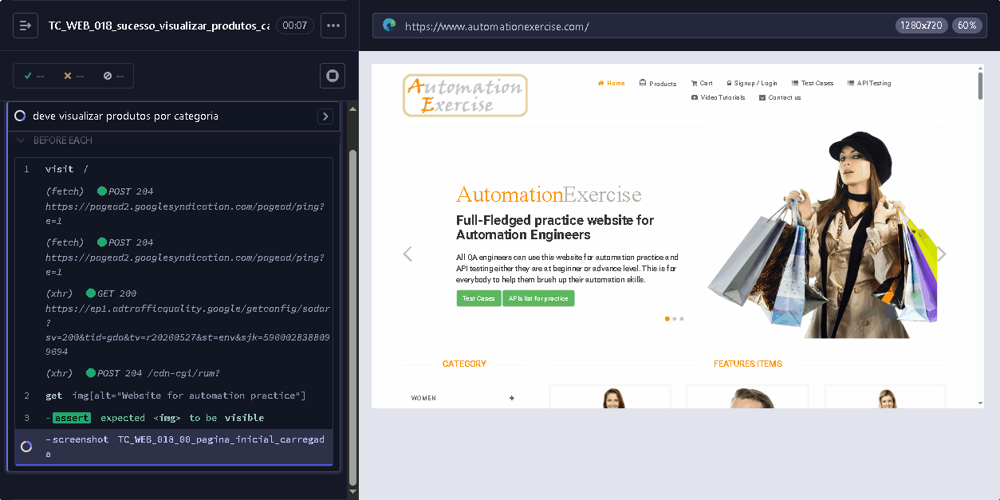

**Cenário:**
```gherkin
Dado que o navegador está aberto e a página inicial carrega
Quando clico em "Products"
Então as categorias devem estar visíveis na barra lateral esquerda
Quando navego para "Women > Dress" e para "Men > Tshirts"
Então as páginas das categorias devem exibir os produtos corretamente
```

---

**F02.04** - Visualizar e adicionar ao carrinho produtos de marcas
- **Tipo:** Sucesso
- **Criticidade:** Média
- **Objetivo:** Validar que produtos de diferentes marcas são exibidos e podem ser adicionados ao carrinho
- **TC:** TC_WEB_019
- **Dado:** Que existem marcas de produto válidas disponíveis
- **Pós-condição:** Nenhuma
- **Resultado esperado:** Marcas exibem produtos e permitem adicionar ao carrinho
- **Script:** [TC_WEB_019_sucesso_visualizar_adicionar_marcas.cy.js](../Cypress/cypress/e2e/web/TC_WEB_019_sucesso_visualizar_adicionar_marcas.cy.js)
- **Evidência:** 

**Cenário:**
```gherkin
Dado que o navegador está aberto e a página inicial carrega
Quando clico em "Products"
Então as marcas devem estar visíveis na barra lateral esquerda
Quando filtro por "Polo" e por "H&M"
Então as páginas das marcas devem exibir os produtos corretamente
Quando adiciono o primeiro produto ao carrinho e clico em "View Cart"
Então o produto deve estar no carrinho
```

---

**F02.05** - Adicionar avaliação em produto
- **Tipo:** Sucesso
- **Criticidade:** Média
- **Objetivo:** Validar que usuário logado pode adicionar avaliação em produto
- **TC:** TC_WEB_021
- **Dado:** Que existe um texto de avaliação de produto disponível
- **Pós-condição:** Nenhuma
- **Resultado esperado:** Usuário consegue avaliar produto
- **Script:** [TC_WEB_021_sucesso_adicionar_avaliacao_produto.cy.js](../Cypress/cypress/e2e/web/TC_WEB_021_sucesso_adicionar_avaliacao_produto.cy.js)
- **Evidência:** 

**Cenário:**
```gherkin
Dado que o navegador está aberto e a página inicial carrega
Quando clico em "Products" e em "View Product" do primeiro produto
Então a página de detalhes e a seção "Write Your Review" devem estar visíveis
Quando preencho nome, email, avaliação e clico em "Submit"
Então o sistema exibe a mensagem "Thank you for your review."
```

---

### F03 - Gestão de Carrinho

---

**F03.01** - Adicionar produtos ao carrinho
- **Tipo:** Sucesso
- **Criticidade:** Crítica
- **Objetivo:** Validar a funcionalidade de adicionar múltiplos itens ao carrinho
- **TC:** TC_WEB_012
- **Dado:** Que existem produtos disponíveis no catálogo
- **Pós-condição:** Nenhuma
- **Resultado esperado:** Carrinho aceita múltiplos produtos com preços e quantidades
- **Script:** [TC_WEB_012_sucesso_adicionar_produtos_carrinho.cy.js](../Cypress/cypress/e2e/web/TC_WEB_012_sucesso_adicionar_produtos_carrinho.cy.js)
- **Evidência:** 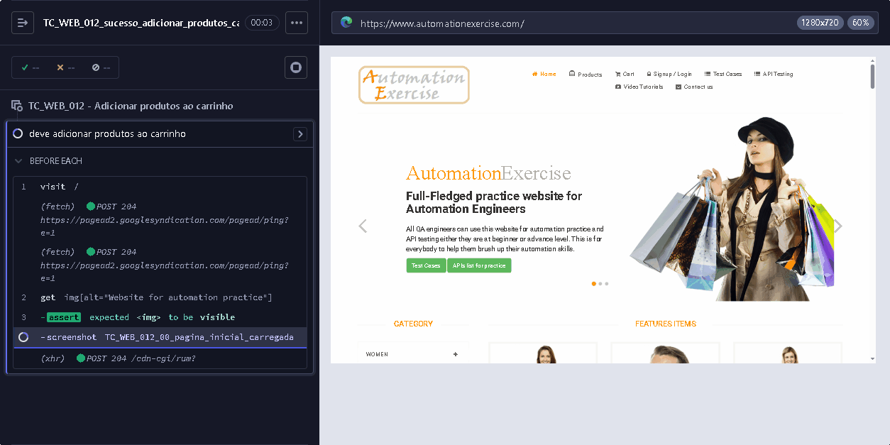

**Cenário:**
```gherkin
Dado que o navegador está aberto e a página inicial carrega
Quando clico em "Products"
E adiciono dois produtos ao carrinho via hover
E clico em "View Cart"
Então a página do carrinho deve estar visível e os dois produtos devem estar listados com preços, quantidades e totais corretos
```

---

**F03.02** - Verificar quantidade de produto no carrinho
- **Tipo:** Sucesso
- **Criticidade:** Alta
- **Objetivo:** Validar o seletor de quantidade na página de detalhes do produto
- **TC:** TC_WEB_013
- **Dado:** Que existe um produto disponível com campo de quantidade editável
- **Pós-condição:** Nenhuma
- **Resultado esperado:** Seletor de quantidade reflete valor escolhido no carrinho
- **Script:** [TC_WEB_013_sucesso_verificar_quantidade_produto_carrinho.cy.js](../Cypress/cypress/e2e/web/TC_WEB_013_sucesso_verificar_quantidade_produto_carrinho.cy.js)
- **Evidência:** 

**Cenário:**
```gherkin
Dado que o navegador está aberto e a página inicial carrega
Quando clico em "View Product", altero a quantidade para "4" e clico em "Add to cart"
E clico em "View Cart"
Então a quantidade do produto no carrinho deve ser exatamente "4"
```

---

**F03.03** - Remover produtos do carrinho
- **Tipo:** Sucesso
- **Criticidade:** Alta
- **Objetivo:** Validar que usuário consegue remover produtos do carrinho
- **TC:** TC_WEB_017
- **Dado:** Que existe um produto disponível no catálogo com quantidade configurável
- **Pós-condição:** Carrinho atualizado
- **Resultado esperado:** Usuário consegue remover itens do carrinho
- **Script:** [TC_WEB_017_sucesso_remover_produtos_carrinho.cy.js](../Cypress/cypress/e2e/web/TC_WEB_017_sucesso_remover_produtos_carrinho.cy.js)
- **Evidência:** 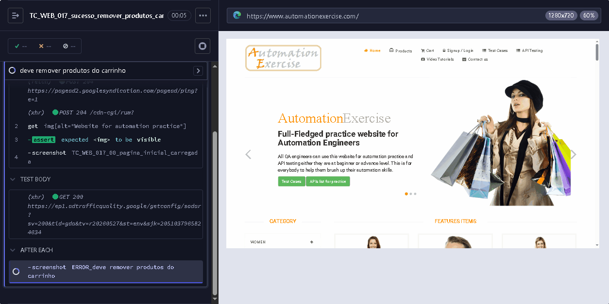

**Cenário:**
```gherkin
Dado que o navegador está aberto e a página inicial carrega
Quando clico em "View Product", altero a quantidade e adiciono ao carrinho
Então a mensagem "Added!" deve estar visível
Quando clico em "View Cart" e removo o produto
Então o produto deve ser removido do carrinho
```

---

**F03.04** - Pesquisar produtos e verificar carrinho após login
- **Tipo:** Sucesso
- **Criticidade:** Crítica
- **Objetivo:** Validar a persistência do carrinho após autenticação
- **TC:** TC_WEB_020
- **Dado:** Que existem credenciais pré-cadastradas e termos de busca válidos disponíveis
- **Pós-condição:** Carrinho persiste após login
- **Resultado esperado:** Carrinho persiste itens após autenticação
- **Script:** [TC_WEB_020_sucesso_pesquisar_produtos_verificar_carrinho_login.cy.js](../Cypress/cypress/e2e/web/TC_WEB_020_sucesso_pesquisar_produtos_verificar_carrinho_login.cy.js)
- **Evidência:** 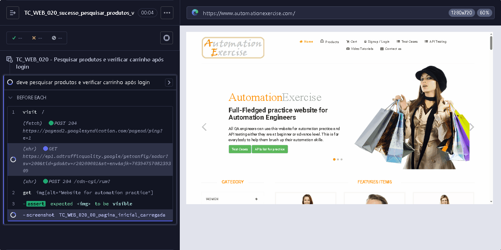

**Cenário:**
```gherkin
Dado que o navegador está aberto e a página inicial carrega
Quando busco por produto, adiciono ao carrinho e verifico no carrinho
Então os produtos devem estar no carrinho
Quando faço login com credenciais válidas
Então o texto "Logged in as [username]" deve estar visível
Quando clico em "Cart"
Então os produtos devem persistir no carrinho após login
```

---

**F03.05** - Adicionar ao carrinho itens recomendados
- **Tipo:** Sucesso
- **Criticidade:** Média
- **Objetivo:** Validar que itens recomendados podem ser adicionados ao carrinho
- **TC:** TC_WEB_022
- **Dado:** Que existem itens recomendados disponíveis na seção inferior da página inicial
- **Pós-condição:** Nenhuma
- **Resultado esperado:** Produtos recomendados são adicionados ao carrinho
- **Script:** [TC_WEB_022_sucesso_adicionar_itens_recomendados_carrinho.cy.js](../Cypress/cypress/e2e/web/TC_WEB_022_sucesso_adicionar_itens_recomendados_carrinho.cy.js)
- **Evidência:** 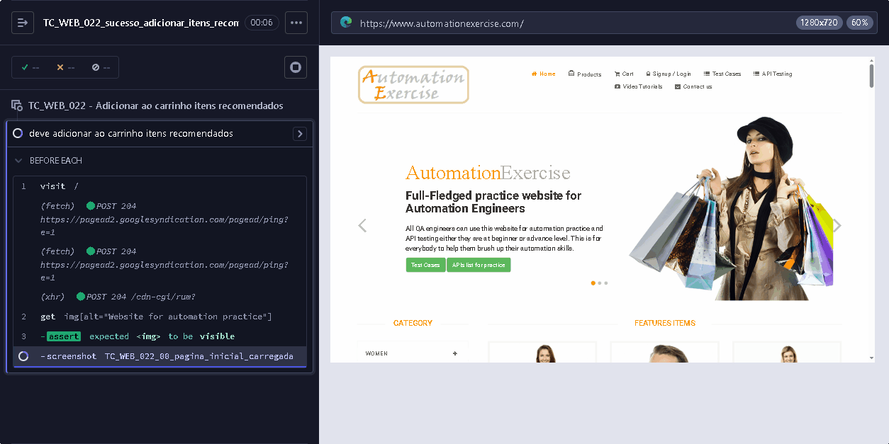

**Cenário:**
```gherkin
Dado que o navegador está aberto e a página inicial carrega
Quando rolo para o final da página
Então a seção "RECOMMENDED ITEMS" deve estar visível
Quando adiciono o produto recomendado ao carrinho e clico em "View Cart"
Então o produto recomendado deve estar na página do carrinho
```

---

### F04 - Fluxo de Checkout e Pedidos

---

**F04.01** - Fazer pedido registrando durante o checkout
- **Tipo:** Sucesso
- **Criticidade:** Crítica
- **Objetivo:** Validar fluxo de compra com registro durante o checkout
- **TC:** TC_WEB_014
- **Dado:** Que existem dados de registro e dados de pagamento disponíveis
- **Pós-condição:** Conta criada e excluída ao final
- **Resultado esperado:** Fluxo completo de compra com registro no checkout
- **Script:** [TC_WEB_014_sucesso_fazer_pedido_registrar_checkout.cy.js](../Cypress/cypress/e2e/web/TC_WEB_014_sucesso_fazer_pedido_registrar_checkout.cy.js)
- **Evidência:** 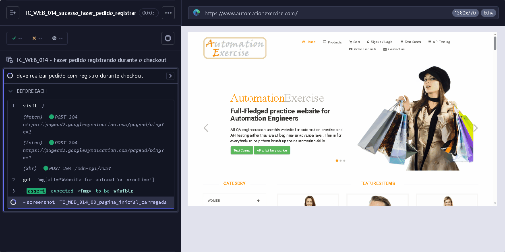

**Cenário:**
```gherkin
Dado que o navegador está aberto e a página inicial carrega
Quando adiciono produtos ao carrinho, prossigo para checkout, clico em "Register / Login" e crio a conta
Então o header "Account Created!" deve estar visível e o nome do usuário exibido
Quando acesso o carrinho e finalizo o checkout com pagamento
Então a mensagem de confirmação do pedido deve estar visível
Quando clico em "Delete Account"
Então o header "Account Deleted!" deve estar visível
```

---

**F04.02** - Fazer pedido registrando antes do checkout
- **Tipo:** Sucesso
- **Criticidade:** Crítica
- **Objetivo:** Validar fluxo de compra com registro prévio ao checkout.
- **TC:** TC_WEB_015
- **Dado:** Que existem dados de registro e dados de pagamento disponíveis
- **Diferencial:** Foco no fluxo completo de compra com registro prévio ao checkout, incluindo fechamento de pedido com pagamento.
- **Pós-condição:** Conta criada e excluída ao final
- **Resultado esperado:** Fluxo completo de compra com registro prévio
- **Script:** [TC_WEB_015_sucesso_fazer_pedido_registrar_antes_checkout.cy.js](../Cypress/cypress/e2e/web/TC_WEB_015_sucesso_fazer_pedido_registrar_antes_checkout.cy.js)
- **Evidência:** 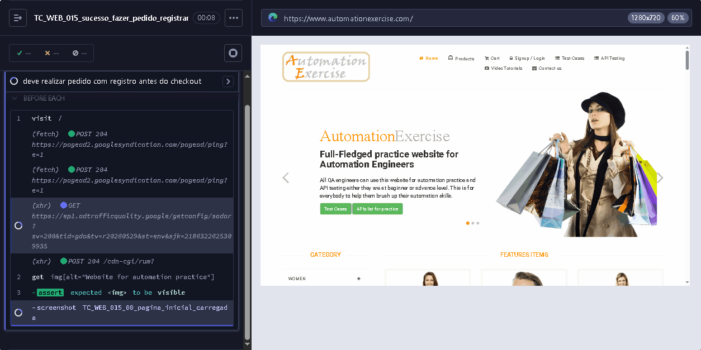

**Cenário:**
```gherkin
Dado que o navegador está aberto e a página inicial carrega
Quando clico em "Signup / Login", preencho dados de registro e crio a conta
Então o header "Account Created!" deve estar visível e o nome do usuário exibido
Quando adiciono produtos ao carrinho, vou ao checkout e finalizo o pedido
Então a mensagem de sucesso deve estar visível
Quando clico em "Delete Account"
Então o header "Account Deleted!" deve estar visível
```

---

**F04.03** - Fazer pedido fazendo login antes do checkout
- **Tipo:** Sucesso
- **Criticidade:** Crítica
- **Objetivo:** Validar fluxo de compra com login prévio usando usuário existente
- **TC:** TC_WEB_016
- **Dado:** Que existem credenciais pré-cadastradas e dados de pagamento disponíveis
- **Pós-condição:** Sessão permanece ativa
- **Resultado esperado:** Usuário logado consegue finalizar compra
- **Script:** [TC_WEB_016_sucesso_fazer_pedido_login_antes_checkout.cy.js](../Cypress/cypress/e2e/web/TC_WEB_016_sucesso_fazer_pedido_login_antes_checkout.cy.js)
- **Evidência:** 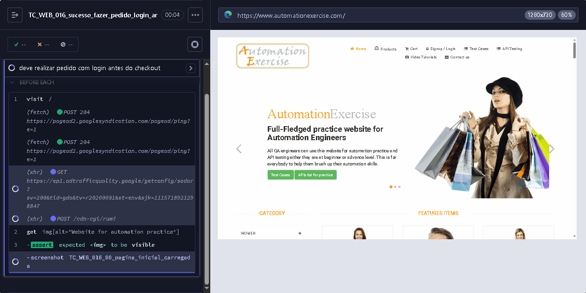

**Cenário:**
```gherkin
Dado que o navegador está aberto e a página inicial carrega
Quando clico em "Signup / Login", preencho email e senha e clico em "Login"
Então o texto "Logged in as [username]" deve estar visível
Quando adiciono produtos ao carrinho, vou ao checkout e finalizo o pedido
Então a mensagem de confirmação do pedido deve estar visível
```

---

**F04.04** - Verificar detalhes do endereço na página de checkout
- **Tipo:** Sucesso
- **Criticidade:** Crítica
- **Objetivo:** Validar que endereços de entrega e cobrança correspondem aos dados registrados. Sem fechamento de pedido com pagamento.
- **TC:** TC_WEB_023
- **Diferencial:** Foco exclusivo na conferência de endereços. Para o fluxo completo de pagamento pós-registro, veja F04.02 (TC_WEB_015).
- **Dado:** Que existem dados de registro disponíveis
- **Pós-condição:** Conta criada e excluída ao final
- **Resultado esperado:** Endereços de entrega e cobrança conferem com cadastro
- **Script:** [TC_WEB_023_sucesso_verificar_detalhes_endereco_checkout.cy.js](../Cypress/cypress/e2e/web/TC_WEB_023_sucesso_verificar_detalhes_endereco_checkout.cy.js)
- **Evidência:** 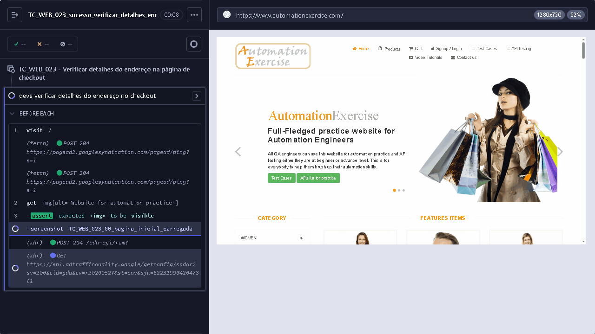

**Cenário:**
```gherkin
Dado que o navegador está aberto e a página inicial carrega
Quando clico em "Signup / Login", preencho dados de registro e crio a conta
Então o header "Account Created!" deve estar visível e o nome do usuário exibido
Quando adiciono produtos ao carrinho e acesso o checkout
Então o endereço de entrega e cobrança devem corresponder aos dados do registro
Quando clico em "Delete Account"
Então o header "Account Deleted!" deve estar visível
```

---

**F04.05** - Baixar fatura após pedido
- **Tipo:** Sucesso
- **Criticidade:** Alta
- **Objetivo:** Validar o processo completo de pedido e download de fatura
- **TC:** TC_WEB_024
- **Dado:** Que existem dados de registro, dados de contato e dados de pagamento disponíveis
- **Pós-condição:** Conta criada e excluída ao final
- **Resultado esperado:** Fatura é gerada e disponível para download
- **Script:** [TC_WEB_024_sucesso_baixar_fatura_pedido.cy.js](../Cypress/cypress/e2e/web/TC_WEB_024_sucesso_baixar_fatura_pedido.cy.js)
- **Evidência:** 

**Cenário:**
```gherkin
Dado que o navegador está aberto e a página inicial carrega
Quando adiciono produto ao carrinho, prossigo para checkout e clico em "Register / Login"
E preencho dados de registro e crio a conta
Então o header "Account Created!" deve estar visível
Quando acesso o carrinho, finalizo o checkout e pago
Então a mensagem de confirmação do pedido deve estar visível e a fatura baixada
Quando excluo a conta
Então o header "Account Deleted!" deve estar visível
```

---

### F05 - Comunicação e Experiência do Usuário

---

**F05.01** - Formulário de contato
- **Tipo:** Sucesso
- **Criticidade:** Média
- **Objetivo:** Validar o envio de mensagens e upload de arquivos
- **TC:** TC_WEB_006
- **Dado:** Que existem dados de contato disponíveis
- **Pós-condição:** Nenhuma
- **Resultado esperado:** Usuário consegue enviar mensagem com arquivo anexado
- **Script:** [TC_WEB_006_sucesso_formulario_contato.cy.js](../Cypress/cypress/e2e/web/TC_WEB_006_sucesso_formulario_contato.cy.js)
- **Evidência:** 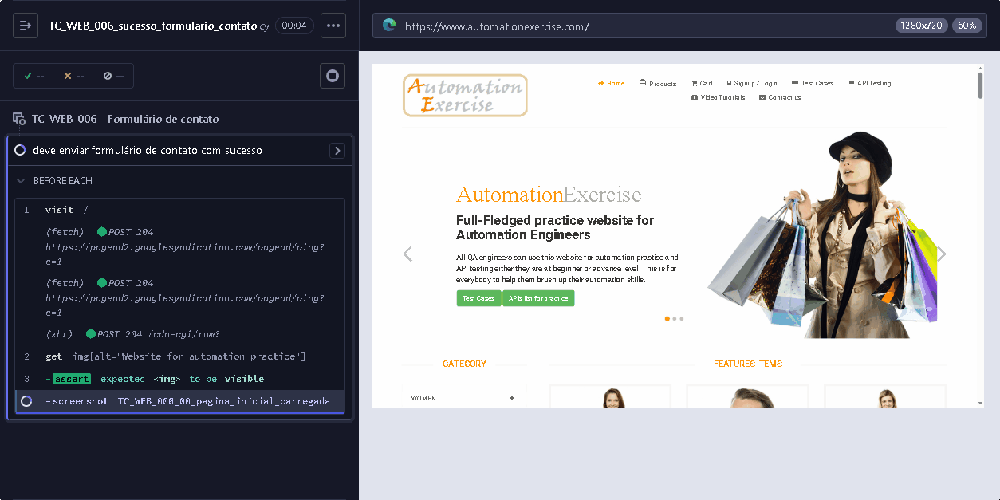

**Cenário:**
```gherkin
Dado que o navegador está aberto e a página inicial carrega
Quando clico em "Contact Us"
Então o header "GET IN TOUCH" e o formulário devem estar visíveis
Quando preencho o formulário, anexo arquivo e clico em "Submit"
Então a mensagem de sucesso deve estar visível
Quando clico em "Home"
Então a página inicial deve estar carregada
```

---

**F05.02** - Verificar página de casos de teste
- **Tipo:** Sucesso
- **Criticidade:** Baixa
- **Objetivo:** Validar navegação para página de casos de teste
- **TC:** TC_WEB_007
- **Dado:** Que existem links de navegação acessíveis na página inicial
- **Pós-condição:** Nenhuma
- **Resultado esperado:** Navegação para página de casos de teste funciona
- **Script:** [TC_WEB_007_sucesso_verificar_pagina_casos_teste.cy.js](../Cypress/cypress/e2e/web/TC_WEB_007_sucesso_verificar_pagina_casos_teste.cy.js)
- **Evidência:** 

**Cenário:**
```gherkin
Dado que o navegador está aberto e a página inicial carrega
Quando clico em "Test Cases"
Então a página de casos de teste é carregada com header "Test Cases" visível
```

---

**F05.03** - Verificar assinatura na página inicial
- **Tipo:** Sucesso
- **Criticidade:** Média
- **Objetivo:** Validar assinatura de newsletter na página inicial
- **TC:** TC_WEB_010
- **Dado:** Que existe um campo de assinatura de newsletter acessível na página inicial
- **Pós-condição:** Nenhuma
- **Resultado esperado:** Usuário consegue assinar newsletter na home
- **Script:** [TC_WEB_010_sucesso_verificar_assinatura_pagina_inicial.cy.js](../Cypress/cypress/e2e/web/TC_WEB_010_sucesso_verificar_assinatura_pagina_inicial.cy.js)
- **Evidência:** 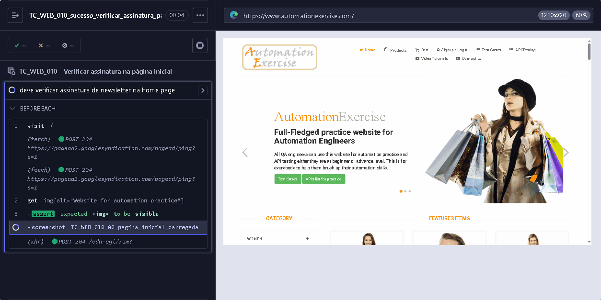

**Cenário:**
```gherkin
Dado que o navegador está aberto e a página inicial carrega
Quando rolo para o rodapé da página
Então o texto "Subscription" deve estar visível
Quando insiro email válido no campo de assinatura
E clico no botão de inscrição
Então a mensagem "You have been successfully subscribed!" deve estar visível
```

---

**F05.04** - Verificar assinatura na página do carrinho
- **Tipo:** Sucesso
- **Criticidade:** Média
- **Objetivo:** Validar assinatura de newsletter na página do carrinho
- **TC:** TC_WEB_011
- **Dado:** Que existe um campo de assinatura de newsletter acessível na página do carrinho
- **Pós-condição:** Nenhuma
- **Resultado esperado:** Usuário consegue assinar newsletter no carrinho
- **Script:** [TC_WEB_011_sucesso_verificar_assinatura_pagina_carrinho.cy.js](../Cypress/cypress/e2e/web/TC_WEB_011_sucesso_verificar_assinatura_pagina_carrinho.cy.js)
- **Evidência:** 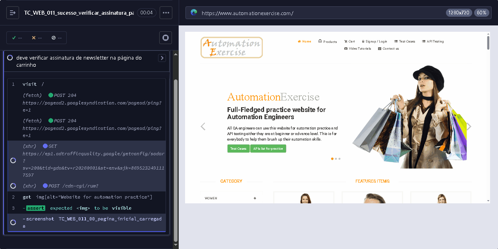

**Cenário:**
```gherkin
Dado que o navegador está aberto e a página inicial carrega
Quando clico em "Cart" e rolo para o rodapé
Então o texto "Subscription" deve estar visível
Quando insiro email e clico no botão de inscrição
Então a mensagem "You have been successfully subscribed!" deve estar visível
```

---

**F05.05** - Scroll up usando botão de seta e funcionalidade scroll down
- **Tipo:** Sucesso
- **Criticidade:** Baixa
- **Objetivo:** Validar a funcionalidade de scroll usando o botão de seta
- **TC:** TC_WEB_025
- **Dado:** Que existem botões de navegação acessíveis na página
- **Pós-condição:** Nenhuma
- **Resultado esperado:** Botão de scroll up retorna ao topo da página
- **Script:** [TC_WEB_025_sucesso_verificar_scroll_seta.cy.js](../Cypress/cypress/e2e/web/TC_WEB_025_sucesso_verificar_scroll_seta.cy.js)
- **Evidência:** 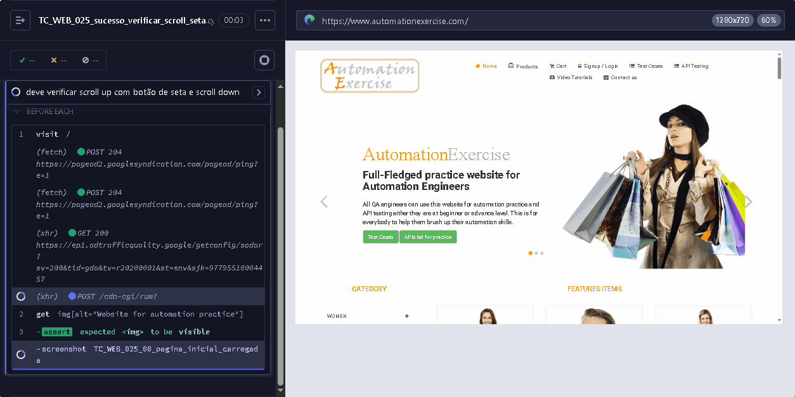

**Cenário:**
```gherkin
Dado que o navegador está aberto e a página inicial carrega
Quando rolo a página para baixo até o rodapé
Então o texto "Subscription" deve estar visível
Quando clico no botão de seta para cima (scroll up)
Então o texto do cabeçalho "Full-Fledged practice website for Automation Engineers" deve estar visível no topo
```

---

**F05.06** - Verificar scroll up sem botão de seta e funcionalidade scroll down
- **Tipo:** Sucesso
- **Criticidade:** Baixa
- **Objetivo:** Validar funcionalidade de scroll manual (sem botão de seta)
- **TC:** TC_WEB_026
- **Dado:** Que existe uma área navegável com scroll
- **Pós-condição:** Nenhuma
- **Resultado esperado:** Scroll manual retorna ao topo da página
- **Script:** [TC_WEB_026_sucesso_verificar_scroll_sem_seta.cy.js](../Cypress/cypress/e2e/web/TC_WEB_026_sucesso_verificar_scroll_sem_seta.cy.js)
- **Evidência:** 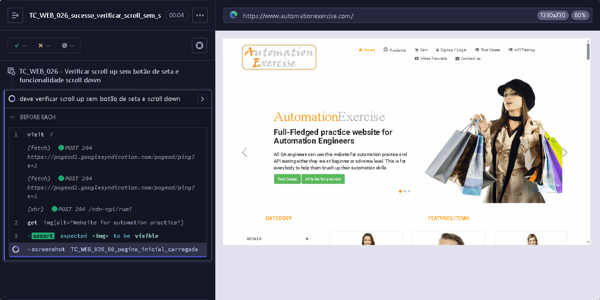

**Cenário:**
```gherkin
Dado que o navegador está aberto e a página inicial carrega
Quando rolo para o rodapé da página
Então o texto "Subscription" deve estar visível
Quando rolo para o topo da página
Então o texto do cabeçalho "Full-Fledged practice website for Automation Engineers" deve estar visível
```

---

## 4. Cenários API

### F06 - API Catálogo de Produtos e Marcas

---

**F06.01** - Listar todos os produtos via API
- **Tipo:** Sucesso
- **Criticidade:** Alta
- **Objetivo:** Validar o retorno da lista completa de produtos do catálogo
- **TC:** TC_API_001
- **Dado:** Que a API de catálogo de produtos está disponível
- **Pós-condição:** Nenhuma alteração
- **Resultado esperado:** API retorna catálogo completo com 34 produtos
- **Script:** [TC_API_001_sucesso_listar_todos_produtos.cy.js](../Cypress/cypress/e2e/api/TC_API_001_sucesso_listar_todos_produtos.cy.js)
- **Evidência:** [`TC_API_001_api_result.html`](https://htmlpreview.github.io/?https://github.com/mtnirvana/AutomationExercise/blob/main/automationexercise/Cypress/cypress/screenshots/api/TC_API_001_api_result.html)

**Cenário:**
```gherkin
Dado que a API do Automation Exercise está disponível
Quando envio uma requisição GET para /api/productsList
Então a resposta deve conter status 200
E o body deve conter responseCode igual a 200
E o body.products deve ser um array
E body.products.length deve ser igual a 34
E cada produto deve possuir as propriedades id, name, price, brand e category
```

---

**F06.02** - Listar todas as marcas via API
- **Tipo:** Sucesso
- **Criticidade:** Alta
- **Objetivo:** Validar o retorno da lista completa de marcas do catálogo
- **TC:** TC_API_002
- **Dado:** Que a API de catálogo de marcas está disponível
- **Pós-condição:** Nenhuma alteração
- **Resultado esperado:** API retorna lista de marcas disponíveis
- **Script:** [TC_API_002_sucesso_listar_todas_marcas.cy.js](../Cypress/cypress/e2e/api/TC_API_002_sucesso_listar_todas_marcas.cy.js)
- **Evidência:** [`TC_API_002_api_result.html`](https://htmlpreview.github.io/?https://github.com/mtnirvana/AutomationExercise/blob/main/automationexercise/Cypress/cypress/screenshots/api/TC_API_002_api_result.html)

**Cenário:**
```gherkin
Dado que a API do Automation Exercise está disponível
Quando envio uma requisição GET para /api/brandsList
Então a resposta deve conter status 200
E o body deve conter responseCode igual a 200
E o body.brands deve ser um array
E body.brands.length deve ser igual a 34
E cada marca deve possuir as propriedades id e brand
```

---

**F06.03** - Pesquisar produto por termo via API
- **Tipo:** Sucesso
- **Criticidade:** Alta
- **Objetivo:** Validar a busca de produtos por termo de pesquisa
- **TC:** TC_API_003
- **Dado:** Que existe um termo de busca 'top' disponível
- **Pós-condição:** Nenhuma alteração
- **Resultado esperado:** API retorna produtos filtrados pelo termo buscado
- **Script:** [TC_API_003_sucesso_pesquisar_produto.cy.js](../Cypress/cypress/e2e/api/TC_API_003_sucesso_pesquisar_produto.cy.js)
- **Evidência:** [`TC_API_003_api_result.html`](https://htmlpreview.github.io/?https://github.com/mtnirvana/AutomationExercise/blob/main/automationexercise/Cypress/cypress/screenshots/api/TC_API_003_api_result.html)

**Cenário:**
```gherkin
Dado que a API do Automation Exercise está disponível
Quando envio uma requisição POST para /api/searchProduct com o parâmetro "search_product" contendo "top"
Então a resposta deve conter status 200
E o body deve conter responseCode igual a 200
E o body.products deve ser um array
E body.products.length deve ser igual a 14
E cada produto deve possuir as propriedades id e name
```

---

**F06.04** - Pesquisar produto sem parâmetro via API
- **Tipo:** Erro
- **Criticidade:** Média
- **Objetivo:** Validar que a API retorna erro quando parâmetro de busca está ausente
- **TC:** TC_API_004
- **Dado:** Que a API de busca de produtos está disponível
- **Pós-condição:** Nenhuma alteração
- **Resultado esperado:** API retorna erro quando parâmetro obrigatório está ausente
- **Script:** [TC_API_004_erro_pesquisar_produto_sem_parametro.cy.js](../Cypress/cypress/e2e/api/TC_API_004_erro_pesquisar_produto_sem_parametro.cy.js)
- **Evidência:** [`TC_API_004_api_result.html`](https://htmlpreview.github.io/?https://github.com/mtnirvana/AutomationExercise/blob/main/automationexercise/Cypress/cypress/screenshots/api/TC_API_004_api_result.html)

**Cenário:**
```gherkin
Dado que a API do Automation Exercise está disponível
Quando envio uma requisição POST para /api/searchProduct sem o parâmetro "search_product"
Então a resposta deve conter status 200
E o body.responseCode deve ser igual a 400
E o body.message deve ser igual a "Bad request, search_product parameter is missing in POST request."
```

---

### F07 - API Autenticação

---

**F07.01** - Verificar login com credenciais válidas via API
- **Tipo:** Sucesso
- **Criticidade:** Crítica
- **Objetivo:** Garantir que a API retorna sucesso quando credenciais válidas são fornecidas
- **TC:** TC_API_005
- **Dado:** Que existem credenciais pré-cadastradas no sistema
- **Pós-condição:** Nenhuma
- **Resultado esperado:** API autentica usuário com credenciais corretas
- **Script:** [TC_API_005_sucesso_verificar_login_valido.cy.js](../Cypress/cypress/e2e/api/TC_API_005_sucesso_verificar_login_valido.cy.js)
- **Evidência:** [`TC_API_005_api_result.html`](https://htmlpreview.github.io/?https://github.com/mtnirvana/AutomationExercise/blob/main/automationexercise/Cypress/cypress/screenshots/api/TC_API_005_api_result.html)

**Cenário:**
```gherkin
Dado que a API do Automation Exercise está disponível
Quando envio uma requisição POST para /api/verifyLogin de usuário com email e senha válidos
Então a resposta deve conter status 200
E o body.responseCode deve ser igual a 200
E o body.message deve ser igual a "User exists!"
```

---

**F07.02** - Verificar login sem email via API
- **Tipo:** Erro
- **Criticidade:** Média
- **Objetivo:** Validar que a API retorna erro quando email está ausente
- **TC:** TC_API_006
- **Dado:** Que a API de autenticação está disponível
- **Pós-condição:** Nenhuma alteração
- **Resultado esperado:** API retorna erro quando campo obrigatório está ausente
- **Script:** [TC_API_006_erro_verificar_login_sem_email.cy.js](../Cypress/cypress/e2e/api/TC_API_006_erro_verificar_login_sem_email.cy.js)
- **Evidência:** [`TC_API_006_api_result.html`](https://htmlpreview.github.io/?https://github.com/mtnirvana/AutomationExercise/blob/main/automationexercise/Cypress/cypress/screenshots/api/TC_API_006_api_result.html)

**Cenário:**
```gherkin
Dado que a API do Automation Exercise está disponível
Quando envio uma requisição POST para /api/verifyLogin sem email
Então a resposta deve conter status 200
E o body.responseCode deve ser igual a 400
E o body.message deve ser igual a "Bad request, email or password parameter is missing in POST request."
```

---

**F07.03** - Verificar login com credenciais inválidas via API
- **Tipo:** Erro
- **Criticidade:** Alta
- **Objetivo:** Validar que a API retorna erro quando credenciais não existem
- **TC:** TC_API_007
- **Dado:** Que existem credenciais inexistentes no sistema
- **Pós-condição:** Nenhuma alteração
- **Resultado esperado:** API rejeita autenticação com dados incorretos
- **Script:** [TC_API_007_erro_verificar_login_invalido.cy.js](../Cypress/cypress/e2e/api/TC_API_007_erro_verificar_login_invalido.cy.js)
- **Evidência:** [`TC_API_007_api_result.html`](https://htmlpreview.github.io/?https://github.com/mtnirvana/AutomationExercise/blob/main/automationexercise/Cypress/cypress/screenshots/api/TC_API_007_api_result.html)

**Cenário:**
```gherkin
Dado que a API do Automation Exercise está disponível
Quando envio uma requisição POST para /api/verifyLogin com credenciais inválidas
Então a resposta deve conter status 200
E o body.responseCode deve ser igual a 404
E o body.message deve ser igual a "User not found!"
```

---

### F08 - API Gestão de Usuários

---

**F08.01** - Criar conta de usuário via API
- **Tipo:** Sucesso
- **Criticidade:** Crítica
- **Objetivo:** Validar a criação de novo usuário via endpoint
- **TC:** TC_API_008
- **Dado:** Que existem dados de registro e a API de criação de conta está disponível
- **Pós-condição:** Usuário criado deve ser excluído após a execução
- **Resultado esperado:** API cria nova conta com dados fornecidos
- **Script:** [TC_API_008_sucesso_criar_conta_usuario.cy.js](../Cypress/cypress/e2e/api/TC_API_008_sucesso_criar_conta_usuario.cy.js)
- **Evidência:** [`TC_API_008_api_result.html`](https://htmlpreview.github.io/?https://github.com/mtnirvana/AutomationExercise/blob/main/automationexercise/Cypress/cypress/screenshots/api/TC_API_008_api_result.html)

**Cenário:**
```gherkin
Dado que a API do Automation Exercise está disponível
E utilizo um e-mail único
Quando envio uma requisição POST para /api/createAccount com o e-mail único
Então a resposta deve conter status 200
E o body.responseCode deve ser igual a 201
E o body.message deve ser igual a "User created!"
E o usuário criado deve ser excluído após a execução
```

---

**F08.02** - Excluir conta de usuário via API
- **Tipo:** Sucesso
- **Criticidade:** Crítica
- **Objetivo:** Validar a exclusão de usuário via endpoint
- **TC:** TC_API_009
- **Dado:** Que existem credenciais pré-cadastradas e a API de exclusão de conta está disponível
- **Pós-condição:** Nenhuma (usuário temporário criado e excluído no mesmo teste)
- **Resultado esperado:** API remove conta existente do sistema
- **Script:** [TC_API_009_sucesso_excluir_conta_usuario.cy.js](../Cypress/cypress/e2e/api/TC_API_009_sucesso_excluir_conta_usuario.cy.js)
- **Evidência:** [`TC_API_009_api_result.html`](https://htmlpreview.github.io/?https://github.com/mtnirvana/AutomationExercise/blob/main/automationexercise/Cypress/cypress/screenshots/api/TC_API_009_api_result.html)

**Cenário:**
```gherkin
Dado que a API do Automation Exercise está disponível
E gero um novo usuário para o teste
Quando envio POST para /api/createAccount e DELETE para /api/deleteAccount
Então a resposta deve conter status 200
E o body.responseCode deve ser igual a 200
E o body.message deve ser igual a "Account deleted!"
```

---

**F08.03** - Atualizar conta de usuário via API
- **Tipo:** Sucesso
- **Criticidade:** Alta
- **Objetivo:** Validar a atualização de dados do usuário via endpoint PUT
- **TC:** TC_API_010
- **Dado:** Que existem dados de registro e a API de atualização de conta está disponível
- **Pós-condição:** Usuário atualizado deve ser excluído após a execução
- **Resultado esperado:** API permite alteração de dados cadastrais
- **Script:** [TC_API_010_sucesso_atualizar_conta_usuario.cy.js](../Cypress/cypress/e2e/api/TC_API_010_sucesso_atualizar_conta_usuario.cy.js)
- **Evidência:** [`TC_API_010_api_result.html`](https://htmlpreview.github.io/?https://github.com/mtnirvana/AutomationExercise/blob/main/automationexercise/Cypress/cypress/screenshots/api/TC_API_010_api_result.html)

**Cenário:**
```gherkin
Dado que a API do Automation Exercise está disponível
E utilizo um e-mail único
Quando envio POST para /api/createAccount e PUT para /api/updateAccount
Então a resposta deve conter status 200
E o body.responseCode deve ser igual a 200
E o body.message deve ser igual a "User updated!"
```

---

**F08.04** - Obter detalhes do usuário por email via API
- **Tipo:** Sucesso
- **Criticidade:** Alta
- **Objetivo:** Validar a busca de detalhes de usuário pelo email
- **TC:** TC_API_011
- **Dado:** Que existem dados de registro e a API de consulta de conta está disponível
- **Pós-condição:** Usuário criado deve ser excluído após a execução
- **Resultado esperado:** API retorna dados do usuário pelo email
- **Script:** [TC_API_011_sucesso_obter_detalhes_usuario_por_email.cy.js](../Cypress/cypress/e2e/api/TC_API_011_sucesso_obter_detalhes_usuario_por_email.cy.js)
- **Evidência:** [`TC_API_011_api_result.html`](https://htmlpreview.github.io/?https://github.com/mtnirvana/AutomationExercise/blob/main/automationexercise/Cypress/cypress/screenshots/api/TC_API_011_api_result.html)

**Cenário:**
```gherkin
Dado que a API do Automation Exercise está disponível
E utilizo um e-mail único
Quando envio POST para /api/createAccount e GET para /api/getUserDetailByEmail
Então a resposta deve conter status 200
E o body.responseCode deve ser igual a 200
E o body deve possuir user com as propriedades name e email
```

---

### F09 - API Validação de Métodos HTTP

---

**F09.01** - Validar método POST em productsList via API
- **Tipo:** Erro
- **Criticidade:** Média
- **Objetivo:** Garantir que POST não é suportado em /api/productsList
- **TC:** TC_API_012
- **Dado:** Que a API de catálogo de produtos está disponível
- **Pós-condição:** Nenhuma alteração
- **Resultado esperado:** API rejeita método não permitido com erro 405
- **Script:** [TC_API_012_erro_validar_metodo_post_em_productslist.cy.js](../Cypress/cypress/e2e/api/TC_API_012_erro_validar_metodo_post_em_productslist.cy.js)
- **Evidência:** [`TC_API_012_api_result.html`](https://htmlpreview.github.io/?https://github.com/mtnirvana/AutomationExercise/blob/main/automationexercise/Cypress/cypress/screenshots/api/TC_API_012_api_result.html)

**Cenário:**
```gherkin
Dado que a API do Automation Exercise está disponível
Quando envio uma requisição POST para /api/productsList
Então a resposta deve conter status 200
E o body.responseCode deve ser igual a 405
E o body.message deve ser igual a "This request method is not supported."
```

---

**F09.02** - Validar método PUT em brandsList via API
- **Tipo:** Erro
- **Criticidade:** Média
- **Objetivo:** Garantir que PUT não é suportado em /api/brandsList
- **TC:** TC_API_013
- **Dado:** Que a API de catálogo de marcas está disponível
- **Pós-condição:** Nenhuma alteração
- **Resultado esperado:** API rejeita método não permitido com erro 405
- **Script:** [TC_API_013_erro_validar_metodo_put_em_brandslist.cy.js](../Cypress/cypress/e2e/api/TC_API_013_erro_validar_metodo_put_em_brandslist.cy.js)
- **Evidência:** [`TC_API_013_api_result.html`](https://htmlpreview.github.io/?https://github.com/mtnirvana/AutomationExercise/blob/main/automationexercise/Cypress/cypress/screenshots/api/TC_API_013_api_result.html)

**Cenário:**
```gherkin
Dado que a API do Automation Exercise está disponível
Quando envio uma requisição PUT para /api/brandsList
Então a resposta deve conter status 200
E o body.responseCode deve ser igual a 405
E o body.message deve ser igual a "This request method is not supported."
```

---

**F09.03** - Validar método DELETE em verifyLogin via API
- **Tipo:** Erro
- **Criticidade:** Média
- **Objetivo:** Garantir que DELETE não é suportado em /api/verifyLogin
- **TC:** TC_API_014
- **Dado:** Que a API de autenticação está disponível
- **Pós-condição:** Nenhuma alteração
- **Resultado esperado:** API rejeita método não permitido com erro 405
- **Script:** [TC_API_014_erro_validar_metodo_delete_em_verifilogin.cy.js](../Cypress/cypress/e2e/api/TC_API_014_erro_validar_metodo_delete_em_verifilogin.cy.js)
- **Evidência:** [`TC_API_014_api_result.html`](https://htmlpreview.github.io/?https://github.com/mtnirvana/AutomationExercise/blob/main/automationexercise/Cypress/cypress/screenshots/api/TC_API_014_api_result.html)

**Cenário:**
```gherkin
Dado que a API do Automation Exercise está disponível
Quando envio uma requisição DELETE para /api/verifyLogin
Então a resposta deve conter status 200
E o body.responseCode deve ser igual a 405
E o body.message deve ser igual a "This request method is not supported."
```

---

## 5. Cobertura de Testes

Este projeto abrange um total de **61 casos de teste individuais no Allure**, organizados para garantir cobertura integral dos requisitos funcionais, de API e de performance.

| Categoria | Total | Sucesso | Erro |
|-----------|-------|---------|------|
| **E2E Tests** | 26 | 24 (92,3%) | 2 (7,7%) |
| **API Tests** | 14 | 8 (57,1%) | 6 (42,9%) |
| **Performance Tests** | 21 checks (14 scripts) | 19 (90,5%) | 2 (9,5%) ⚠️¹ |
| **Total Consolidado** | **61** | **51 (83,6%)** | **10 (16,4%)** |

> **Nota:** Os 2 cenários com rate limit (TC_PF_005 e TC_PF_007) são limitação do Cloudflare sob carga extrema (300 VUs e 200 VUs). API e HTML pages rodam sem erro em seus respectivos níveis de carga. Thresholds ampliados para `rate<0.90`.

> **Nota:** Performance tests são 14 scripts (13 k6 + 1 Cypress), que geram 21 checks individuais no Allure (13 k6 + 8 Core Web Vitals). Os 8 checks do TC_PF_008 elevam o total para 61 casos no Allure (26 E2E + 14 API + 21 Performance). Em termos BDD (cenários descritíveis em Gherkin), o total é de 40 cenários (26 E2E + 14 API).
>
> ¹ Os 2 cenários classificados como "Erro" (TC_PF_005 e TC_PF_007) são Limitação de Rate Limiting do Cloudflare sob carga extrema (300 VUs e 200 VUs), não erros funcionais. Thresholds ampliados para `rate<0.90`. Testes executados sequencialmente (3 rodadas) com resultados consistentes.

### 5.1 Cobertura por Área Funcional - E2E

| Área Funcional | Cenários | Descrição |
|----------------|----------|-----------|
| **F01 - Gestão de Identidade e Acesso** | 5 cenários | Registro, Login (sucesso/erro), Logout |
| **F02 - Catálogo de Produtos** | 5 cenários | Detalhes, Busca, Categorias, Marcas, Avaliação |
| **F03 - Gestão de Carrinho** | 5 cenários | Adição, Remoção, Quantidade, Persistência, Recomendados |
| **F04 - Fluxo de Checkout e Pedidos** | 5 cenários | Checkout (3 fluxos), Endereço, Fatura |
| **F05 - Comunicação e Experiência do Usuário** | 6 cenários | Contato, Casos de Teste, Newsletter (2x), Scroll UP/DOWN |

### 5.2 Cobertura por Área Funcional - API

| Área Funcional | Cenários | Descrição |
|----------------|----------|-----------|
| **F06 - Catálogo de Produtos e Marcas** | 4 cenários | Listar produtos, Listar marcas, Pesquisar (sucesso/erro) |
| **F07 - Autenticação** | 3 cenários | Login válido, Sem email, Credenciais inválidas |
| **F08 - Gestão de Usuários** | 4 cenários | Criar, Excluir, Atualizar, Obter detalhes |
| **F09 - Validação de Métodos HTTP** | 3 cenários | POST/PUT/DELETE não suportados |

### 5.3 Critérios de Cobertura
- **E2E:** 100% das funcionalidades críticas (Login, Checkout, Carrinho)
- **API:** 100% dos endpoints documentados (8 endpoints, 14 cenários de validação)
- **Performance:** 21 cenários de carga, estresse, resistência, pico e auditoria (k6 + Lighthouse)
- **Falhas Esperadas:** Validação de erros cobrindo cenários de exceção

---

## 6. Critérios de Aceite

Um cenário é considerado **CONCLUÍDO** quando:
1. Todas as validações passam
2. Evidências são geradas corretamente
3. Rotina de cleanup executada quando aplicável
4. Documentação atualizada com os resultados.

---

## 7. Glossário de Termos BDD

| Termo | Definição |
|-------|-----------|
| **Funcionalidade** | Agrupamento de cenários relacionados a uma área de negócio |
| **Cenário** | Descrição de um caso de teste em linguagem de negócio |
| **Dado (Given)** | Pré-condição ou contexto inicial do cenário |
| **Quando (When)** | Ação ou evento que desencadeia o cenário |
| **Então (Then)** | Resultado esperado ou asserção |
| **E (And)** | Conector para encadear condições ou ações |
| **Tag** | Marcador para categorização de cenários |

---

## 8. Mapeamento de Test Cases

### 8.1 E2E

| ID | Funcionalidade | Cenário | Tipo | Documento de Referência |
|----|----------------|---------|------|:-----------------------|
| TC_WEB_001 | F01 | Registrar usuário | Sucesso | [`Especificacao_Tecnica_Web.md`](Especificacao_Tecnica_Web.md) |
| TC_WEB_002 | F01 | Login de usuário com email e senha corretos | Sucesso | [`Especificacao_Tecnica_Web.md`](Especificacao_Tecnica_Web.md) |
| TC_WEB_003 | F01 | Login de usuário com email e senha incorretos | Erro | [`Especificacao_Tecnica_Web.md`](Especificacao_Tecnica_Web.md) |
| TC_WEB_004 | F01 | Logout de usuário | Sucesso | [`Especificacao_Tecnica_Web.md`](Especificacao_Tecnica_Web.md) |
| TC_WEB_005 | F01 | Registrar usuário com email existente | Erro | [`Especificacao_Tecnica_Web.md`](Especificacao_Tecnica_Web.md) |
| TC_WEB_006 | F05 | Formulário de contato | Sucesso | [`Especificacao_Tecnica_Web.md`](Especificacao_Tecnica_Web.md) |
| TC_WEB_007 | F05 | Verificar página de casos de teste | Sucesso | [`Especificacao_Tecnica_Web.md`](Especificacao_Tecnica_Web.md) |
| TC_WEB_008 | F02 | Verificar todos os produtos e página de detalhes do produto | Sucesso | [`Especificacao_Tecnica_Web.md`](Especificacao_Tecnica_Web.md) |
| TC_WEB_009 | F02 | Pesquisar produto | Sucesso | [`Especificacao_Tecnica_Web.md`](Especificacao_Tecnica_Web.md) |
| TC_WEB_010 | F05 | Verificar assinatura na página inicial | Sucesso | [`Especificacao_Tecnica_Web.md`](Especificacao_Tecnica_Web.md) |
| TC_WEB_011 | F05 | Verificar assinatura na página do carrinho | Sucesso | [`Especificacao_Tecnica_Web.md`](Especificacao_Tecnica_Web.md) |
| TC_WEB_012 | F03 | Adicionar produtos ao carrinho | Sucesso | [`Especificacao_Tecnica_Web.md`](Especificacao_Tecnica_Web.md) |
| TC_WEB_013 | F03 | Verificar quantidade de produto no carrinho | Sucesso | [`Especificacao_Tecnica_Web.md`](Especificacao_Tecnica_Web.md) |
| TC_WEB_014 | F04 | Fazer pedido registrando durante o checkout | Sucesso | [`Especificacao_Tecnica_Web.md`](Especificacao_Tecnica_Web.md) |
| TC_WEB_015 | F04 | Fazer pedido registrando antes do checkout | Sucesso | [`Especificacao_Tecnica_Web.md`](Especificacao_Tecnica_Web.md) |
| TC_WEB_016 | F04 | Fazer pedido fazendo login antes do checkout | Sucesso | [`Especificacao_Tecnica_Web.md`](Especificacao_Tecnica_Web.md) |
| TC_WEB_017 | F03 | Remover produtos do carrinho | Sucesso | [`Especificacao_Tecnica_Web.md`](Especificacao_Tecnica_Web.md) |
| TC_WEB_018 | F02 | Visualizar produtos por categoria | Sucesso | [`Especificacao_Tecnica_Web.md`](Especificacao_Tecnica_Web.md) |
| TC_WEB_019 | F02 | Visualizar e adicionar ao carrinho produtos de marcas | Sucesso | [`Especificacao_Tecnica_Web.md`](Especificacao_Tecnica_Web.md) |
| TC_WEB_020 | F03 | Pesquisar produtos e verificar carrinho após login | Sucesso | [`Especificacao_Tecnica_Web.md`](Especificacao_Tecnica_Web.md) |
| TC_WEB_021 | F02 | Adicionar avaliação em produto | Sucesso | [`Especificacao_Tecnica_Web.md`](Especificacao_Tecnica_Web.md) |
| TC_WEB_022 | F03 | Adicionar ao carrinho itens recomendados | Sucesso | [`Especificacao_Tecnica_Web.md`](Especificacao_Tecnica_Web.md) |
| TC_WEB_023 | F04 | Verificar detalhes do endereço na página de checkout | Sucesso | [`Especificacao_Tecnica_Web.md`](Especificacao_Tecnica_Web.md) |
| TC_WEB_024 | F04 | Baixar fatura após pedido | Sucesso | [`Especificacao_Tecnica_Web.md`](Especificacao_Tecnica_Web.md) |
| TC_WEB_025 | F05 | Verificar scroll up usando botão de seta e funcionalidade scroll down | Sucesso | [`Especificacao_Tecnica_Web.md`](Especificacao_Tecnica_Web.md) |
| TC_WEB_026 | F05 | Verificar scroll up sem botão de seta e funcionalidade scroll down | Sucesso | [`Especificacao_Tecnica_Web.md`](Especificacao_Tecnica_Web.md) |

### 8.2 API

| ID | Funcionalidade | Cenário | Tipo | Documento de Referência |
|----|----------------|---------|------|:-----------------------|
| TC_API_001 | F06 | Listar todos os produtos | Sucesso | [`Especificacao_Tecnica_API.md`](Especificacao_Tecnica_API.md) |
| TC_API_002 | F06 | Listar todas as marcas | Sucesso | [`Especificacao_Tecnica_API.md`](Especificacao_Tecnica_API.md) |
| TC_API_003 | F06 | Pesquisar produto por termo | Sucesso | [`Especificacao_Tecnica_API.md`](Especificacao_Tecnica_API.md) |
| TC_API_004 | F06 | Pesquisar sem parâmetro | Erro | [`Especificacao_Tecnica_API.md`](Especificacao_Tecnica_API.md) |
| TC_API_005 | F07 | Login válido | Sucesso | [`Especificacao_Tecnica_API.md`](Especificacao_Tecnica_API.md) |
| TC_API_006 | F07 | Login sem email | Erro | [`Especificacao_Tecnica_API.md`](Especificacao_Tecnica_API.md) |
| TC_API_007 | F07 | Login com credenciais inválidas | Erro | [`Especificacao_Tecnica_API.md`](Especificacao_Tecnica_API.md) |
| TC_API_008 | F08 | Criar conta | Sucesso | [`Especificacao_Tecnica_API.md`](Especificacao_Tecnica_API.md) |
| TC_API_009 | F08 | Excluir conta | Sucesso | [`Especificacao_Tecnica_API.md`](Especificacao_Tecnica_API.md) |
| TC_API_010 | F08 | Atualizar conta | Sucesso | [`Especificacao_Tecnica_API.md`](Especificacao_Tecnica_API.md) |
| TC_API_011 | F08 | Obter detalhes por email | Sucesso | [`Especificacao_Tecnica_API.md`](Especificacao_Tecnica_API.md) |
| TC_API_012 | F09 | POST não suportado em productsList | Erro | [`Especificacao_Tecnica_API.md`](Especificacao_Tecnica_API.md) |
| TC_API_013 | F09 | PUT não suportado em brandsList | Erro | [`Especificacao_Tecnica_API.md`](Especificacao_Tecnica_API.md) |
| TC_API_014 | F09 | DELETE não suportado em verifyLogin | Erro | [`Especificacao_Tecnica_API.md`](Especificacao_Tecnica_API.md) |

### 8.3 Performance

| ID | Funcionalidade | Cenário | Tipo | Documento de Referência |
|----|----------------|---------|------|:-----------------------|
| TC_PF_001 | Performance | Smoke test de validação do pipeline | Smoke | [`Especificacao_Tecnica_Performance.md`](Especificacao_Tecnica_Performance.md) |
| TC_PF_002 | Performance | Carga concorrente na página inicial | Carga | [`Especificacao_Tecnica_Performance.md`](Especificacao_Tecnica_Performance.md) |
| TC_PF_003 | Performance | Carga no endpoint /api/productsList | Carga | [`Especificacao_Tecnica_Performance.md`](Especificacao_Tecnica_Performance.md) |
| TC_PF_004 | Performance | Carga no endpoint /api/verifyLogin | Carga | [`Especificacao_Tecnica_Performance.md`](Especificacao_Tecnica_Performance.md) |
| TC_PF_005 | Performance | Estresse progressivo no /api/productsList | Estresse | [`Especificacao_Tecnica_Performance.md`](Especificacao_Tecnica_Performance.md) |
| TC_PF_006 | Performance | Resistência sustentada com mix de endpoints | Resistência | [`Especificacao_Tecnica_Performance.md`](Especificacao_Tecnica_Performance.md) |
| TC_PF_007 | Performance | Pico repentino de tráfego | Pico | [`Especificacao_Tecnica_Performance.md`](Especificacao_Tecnica_Performance.md) |
| TC_PF_008 | Performance | Métricas Core Web Vitals (Lighthouse) | Front-end | [`Especificacao_Tecnica_Performance.md`](Especificacao_Tecnica_Performance.md) |
| TC_PF_009 | Performance | Carga no fluxo completo de checkout | Carga | [`Especificacao_Tecnica_Performance.md`](Especificacao_Tecnica_Performance.md) |
| TC_PF_010 | Performance | Análise de tamanho e formato de imagens | Auditoria | [`Especificacao_Tecnica_Performance.md`](Especificacao_Tecnica_Performance.md) |
| TC_PF_011 | Performance | Carga no endpoint PUT /api/updateAccount | Carga | [`Especificacao_Tecnica_Performance.md`](Especificacao_Tecnica_Performance.md) |
| TC_PF_012 | Performance | Carga no endpoint GET /api/getUserDetailByEmail | Carga | [`Especificacao_Tecnica_Performance.md`](Especificacao_Tecnica_Performance.md) |
| TC_PF_013 | Performance | Carga no endpoint POST /api/searchProduct | Carga | [`Especificacao_Tecnica_Performance.md`](Especificacao_Tecnica_Performance.md) |
| TC_PF_014 | Performance | Carga na página de produtos (/products) | Carga | [`Especificacao_Tecnica_Performance.md`](Especificacao_Tecnica_Performance.md) |

---

## 9. Endpoints API Documentados

| Método | Endpoint | Descrição |
|--------|----------|-----------|
| GET | /api/productsList | Lista todos os produtos |
| GET | /api/brandsList | Lista todas as marcas |
| GET | /api/getUserDetailByEmail | Busca detalhes de usuário por email |
| POST | /api/searchProduct | Pesquisa produtos |
| POST | /api/verifyLogin | Verifica credenciais de login |
| POST | /api/createAccount | Cria nova conta de usuário |
| PUT | /api/updateAccount | Atualiza dados do usuário |
| DELETE | /api/deleteAccount | Exclui conta de usuário |

---

**Documento gerado em:** 2026-06-02
